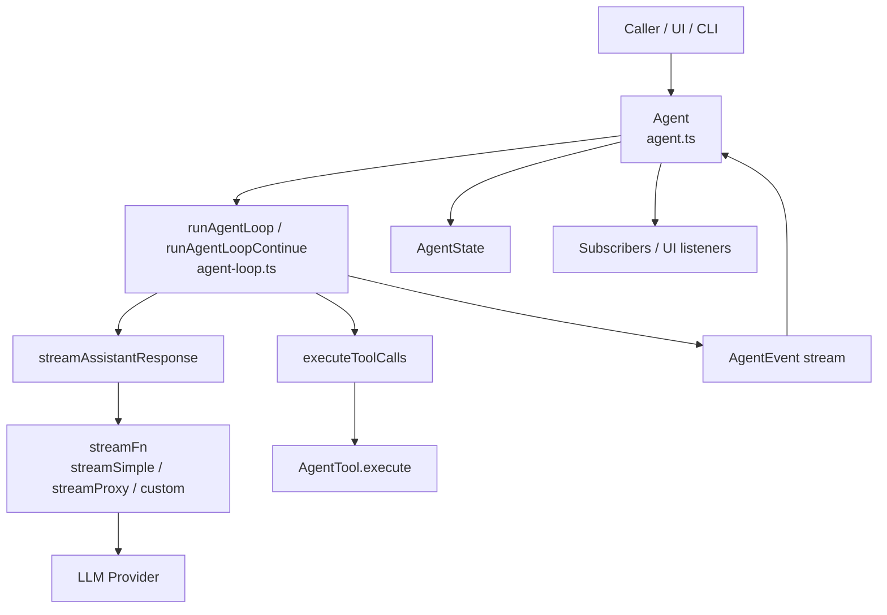
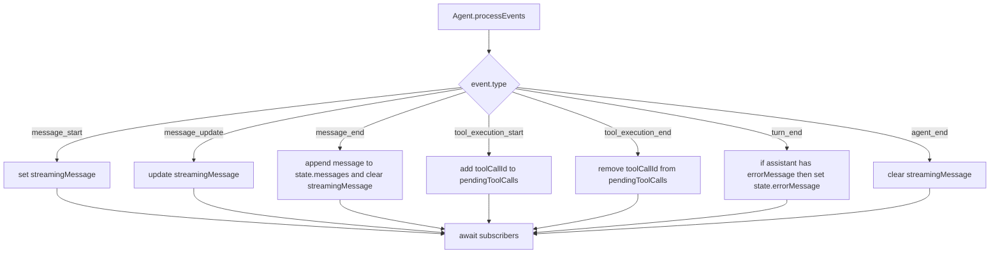

# agent.ts 与 agent-loop.ts 流程分析

## 说明

本文分析 `pi-mono/packages/agent/src/agent.ts` 与 `pi-mono/packages/agent/src/agent-loop.ts` 的职责分层、核心执行流程，以及适合文档化表达的组件关系图和时序图。

相关源码：

- `pi-mono/packages/agent/src/agent.ts`
- `pi-mono/packages/agent/src/agent-loop.ts`

## 总体分层

这两个文件构成一个典型的“双层 Agent Runtime”：

- `agent.ts`：有状态外观层
- `agent-loop.ts`：无状态执行引擎层

它们的边界很清晰：

- `Agent` 负责持有状态、生命周期、队列、事件订阅者
- `agentLoop` 负责跑消息循环、模型流、工具执行流

可以概括为：

```text
Agent = 状态机外壳 + 宿主接口
agent-loop = 执行引擎 + 事件发射器
```

## 核心职责拆分

### agent.ts

`agent.ts` 中的 `Agent` 类主要负责：

- 暴露 `prompt()` 和 `continue()` API
- 管理 `AgentState`
- 管理 `steeringQueue` 和 `followUpQueue`
- 创建 `AgentContext` 快照
- 创建 `AgentLoopConfig`
- 调用 `runAgentLoop()` / `runAgentLoopContinue()`
- 消费 loop 产生的 `AgentEvent`
- 根据事件回写内部状态
- 将事件广播给 subscribers
- 处理 abort / idle / error fallback / finishRun

它是宿主真正直接使用的对象。

### agent-loop.ts

`agent-loop.ts` 主要负责：

- 启动低层 loop
- 将 prompt 注入上下文
- 流式拉取 assistant response
- 判断是否有 tool calls
- 执行工具并生成 tool result message
- 在多轮 turn 中处理 steering / follow-up 消息
- 发出完整事件序列

它本身不持有宿主级状态，只工作在传入的 context 副本上。

## 组件关系图



## 主流程图

下面是从 `prompt()` 进入直到一次运行结束的主流程。

```mermaid
flowchart TD
    A[Caller invokes Agent.prompt or Agent.continue] --> B[Agent.normalizePromptInput]
    B --> C[Agent.runWithLifecycle]
    C --> D[Create AbortController and set isStreaming=true]
    D --> E[Agent.createContextSnapshot]
    E --> F[Agent.createLoopConfig]
    F --> G[runAgentLoop or runAgentLoopContinue]

    G --> H[emit agent_start]
    H --> I[emit turn_start]
    I --> J[emit prompt message_start and message_end]
    J --> K[runLoop]

    K --> L{Pending steering messages?}
    L -->|yes| M[Inject steering messages]
    L -->|no| N[streamAssistantResponse]
    M --> N

    N --> O[transformContext optional]
    O --> P[convertToLlm]
    P --> Q[streamFn]
    Q --> R[Receive assistant stream events]
    R --> S[emit message_start or update or end]

    S --> T{Assistant stopReason error or aborted?}
    T -->|yes| U[emit turn_end]
    U --> V[emit agent_end]
    T -->|no| W[Extract tool calls]

    W --> X{Has tool calls?}
    X -->|no| Y[emit turn_end]
    X -->|yes| Z[executeToolCalls]

    Z --> AA[prepareToolCall]
    AA --> AB[validate args and beforeToolCall hook]
    AB --> AC[executePreparedToolCall]
    AC --> AD[emit tool_execution_update optional]
    AD --> AE[finalizeExecutedToolCall]
    AE --> AF[afterToolCall hook]
    AF --> AG[emit tool_execution_end]
    AG --> AH[emit toolResult message_start and end]
    AH --> Y

    Y --> AI[Poll steering queue again]
    AI --> AJ{More tool calls or steering?}
    AJ -->|yes| N
    AJ -->|no| AK[Poll follow-up queue]

    AK --> AL{Has follow-up messages?}
    AL -->|yes| AM[Set pending follow-up and continue outer loop]
    AM --> K
    AL -->|no| V

    V --> AN[Agent.processEvents updates state]
    AN --> AO[Notify listeners in registration order]
    AO --> AP[finishRun clears runtime-owned state]
```



## 关键执行路径说明

### 1. Agent.prompt()

`Agent.prompt()` 做的事情很少，核心是：

- 防止并发运行
- 规范化输入
- 委托给 `runPromptMessages()`

如果输入是字符串，它会转换成一条 `user` 消息；如果附带图片，也会并到同一条 user content 中。

### 2. runWithLifecycle()

这是 `agent.ts` 中非常重要的一层包装。它负责：

- 创建 `AbortController`
- 建立 `activeRun`
- 设置 `state.isStreaming = true`
- 清空上一轮错误
- 执行低层 loop
- 如果抛错则合成一条失败 assistant message
- 在 finally 中统一调用 `finishRun()`

也就是说，`runWithLifecycle()` 决定了“运行边界”和“失败兜底语义”。

### 3. runAgentLoop()

`runAgentLoop()` 是低层入口，它会：

- 创建新的 context 副本
- 发出 `agent_start`
- 发出第一轮 `turn_start`
- 对 prompt 先发 message lifecycle 事件
- 然后进入 `runLoop()`

### 4. runLoop()

`runLoop()` 是真正的核心循环。它有两层控制逻辑：

- 内层循环：处理一轮轮 assistant response + tool calls + steering
- 外层循环：在“本来要结束”的时候检查 follow-up 消息并决定是否继续

这让 Agent 支持：

- 中途插入 steering 指令
- 执行完成后继续处理 follow-up
- assistant 发出工具调用后自动多轮推进

### 5. streamAssistantResponse()

每次调用模型时都会经过这个函数。它的步骤是：

1. 对 `AgentMessage[]` 执行 `transformContext`
2. 执行 `convertToLlm`
3. 构造标准 `Context`
4. 调用 `streamFn`
5. 将流式事件转成 `message_start` / `message_update` / `message_end`

这个函数是“应用级 transcript”和“模型级消息流”之间的边界。

### 6. executeToolCalls()

当 assistant message 中包含 `toolCall` 时，loop 进入工具执行阶段。

这里采用三段式流程：

1. `prepareToolCall()`
2. `executePreparedToolCall()`
3. `finalizeExecutedToolCall()`

这三段分别负责：

- 找工具、准备参数、schema 校验、`beforeToolCall`
- 真正执行工具、接收中间 update
- 执行 `afterToolCall`，并发出最终 tool result 事件

## 普通 Prompt 的时序图

以下时序图描述“没有工具调用”的典型路径。

```mermaid
sequenceDiagram
    participant Caller
    participant Agent as Agent(agent.ts)
    participant Loop as agent-loop.ts
    participant Stream as streamFn
    participant Model as LLM Provider

    Caller->>Agent: prompt("Hello")
    Agent->>Agent: normalizePromptInput()
    Agent->>Agent: runWithLifecycle()
    Agent->>Loop: runAgentLoop(messages, context, config)

    Loop->>Agent: agent_start
    Loop->>Agent: turn_start
    Loop->>Agent: message_start(user)
    Loop->>Agent: message_end(user)

    Loop->>Stream: stream(model, llmContext, options)
    Stream->>Model: send request
    Model-->>Stream: streaming chunks
    Stream-->>Loop: start / update / done

    Loop->>Agent: message_start(assistant)
    Loop->>Agent: message_update(assistant)*
    Loop->>Agent: message_end(assistant)
    Loop->>Agent: turn_end
    Loop->>Agent: agent_end

    Agent->>Agent: finishRun()
    Agent-->>Caller: resolved
```

## 带 Tool Call 的时序图

以下时序图描述“assistant 先发工具调用，再继续下一轮回答”的路径。

```mermaid
sequenceDiagram
    participant Caller
    participant Agent as Agent(agent.ts)
    participant Loop as agent-loop.ts
    participant Stream as streamFn
    participant Tool as AgentTool
    participant Model as LLM Provider

    Caller->>Agent: prompt("Calculate 123 * 456")
    Agent->>Loop: runAgentLoop(...)

    Loop->>Agent: agent_start
    Loop->>Agent: turn_start
    Loop->>Agent: message_start(user)
    Loop->>Agent: message_end(user)

    Loop->>Stream: stream(...)
    Stream->>Model: send request
    Model-->>Stream: assistant response with toolCall
    Stream-->>Loop: start / update / done

    Loop->>Agent: message_start(assistant)
    Loop->>Agent: message_update(assistant)*
    Loop->>Agent: message_end(assistant)

    Loop->>Agent: tool_execution_start
    Loop->>Loop: prepareToolCall()
    Loop->>Loop: validateToolArguments()
    Loop->>Loop: beforeToolCall hook optional
    Loop->>Tool: execute(toolCallId, args, signal, onUpdate)

    Tool-->>Loop: partialResult*
    Loop->>Agent: tool_execution_update*

    Tool-->>Loop: AgentToolResult
    Loop->>Loop: afterToolCall hook optional
    Loop->>Agent: tool_execution_end
    Loop->>Agent: message_start(toolResult)
    Loop->>Agent: message_end(toolResult)
    Loop->>Agent: turn_end

    Loop->>Agent: turn_start
    Loop->>Stream: stream(updated context including toolResult)
    Stream->>Model: continue with tool result
    Model-->>Stream: final assistant answer
    Stream-->>Loop: start / update / done

    Loop->>Agent: message_start(assistant)
    Loop->>Agent: message_update(assistant)*
    Loop->>Agent: message_end(assistant)
    Loop->>Agent: turn_end
    Loop->>Agent: agent_end

    Agent->>Agent: finishRun()
    Agent-->>Caller: resolved
```

## Agent 内部状态折叠图

`Agent` 并不直接驱动 loop 的内部过程，而是通过 `processEvents()` 根据事件折叠出运行时状态。



## 设计上的关键点

### 1. 状态与执行分层

`Agent` 不直接实现具体 loop，而是把执行委托给 `agent-loop.ts`。这使得：

- 高层 API 更清晰
- 状态管理与执行逻辑解耦
- 低层 loop 更容易单测
- 高层 Agent 更适合给 UI/CLI 直接使用

### 2. 事件是解耦边界

`agent-loop.ts` 不更新宿主状态；它只发事件。

`agent.ts` 不直接跑模型；它只消费事件并回写状态。

这意味着：

- loop 可以更纯粹
- UI 订阅与状态变更共享同一套事件协议

### 3. 队列模型支持复杂交互

`steeringQueue` 和 `followUpQueue` 不是装饰功能，而是 loop 结构中的一等能力。

它们让 Agent 支持：

- 运行中插入用户指令
- 本轮完成后再继续排队任务
- 比单次 request-response 更复杂的协作模式

### 4. 工具执行是流水线

工具调用不是一次黑盒函数调用，而是：

- preflight
- execution
- finalize

这使得权限控制、参数适配、审计、结果后处理都有稳定挂点。

## 结论

`agent.ts` 与 `agent-loop.ts` 组成了一个边界非常清楚的 Agent Runtime：

- `agent.ts` 是状态化控制器
- `agent-loop.ts` 是无状态执行引擎
- 两者通过 `AgentEvent` 连接

这种设计非常适合：

- CLI agent
- UI agent
- 需要 tool use 的多轮运行时
- 需要中途插入控制消息的协作场景

如果后续继续扩展，最合理的方向依然不是把更多逻辑直接塞进 `Agent`，而是沿现有边界扩展：

- 在 loop 层扩展执行语义
- 在 event 层扩展可观察性
- 在 Agent 层扩展宿主控制能力
