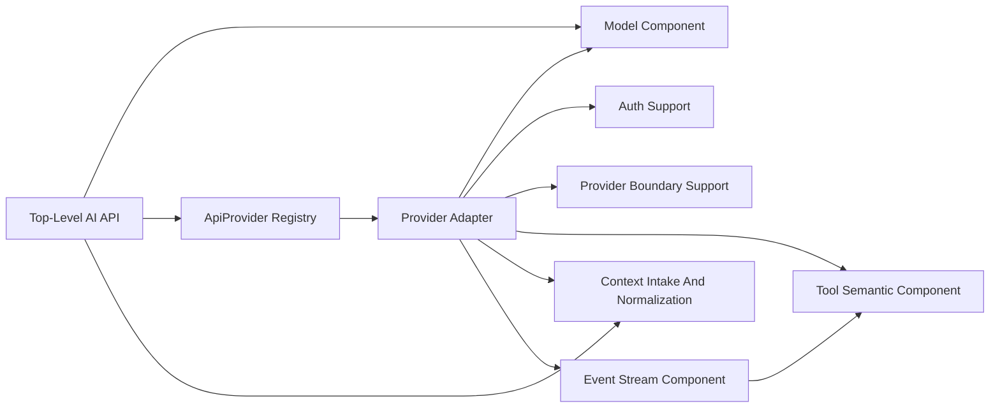

# Loushang-AI Component Interfaces V1（同步现状）

## Scope

本文档基于当前 `loushang-ai` 的组件结构草案，给出第一版组件接口与组件间契约。

本文档只讨论：

- 核心组件的职责边界
- 组件的主要输入 / 输出
- 组件对外暴露的稳定接口方向
- 关键组件之间的依赖契约

本文档不讨论：

- 代码文件结构
- 具体类定义
- 字段级类型细节
- 最终 Python typing 定稿

---

## Input Documents

- [Loushang-AI Component Structure V1](./loushang-ai-component-structure-v1.md)
- [Loushang-AI Component Refinement Round 1](./loushang-ai-component-refinement-round-1.md)
- [Loushang-AI Streaming and Cancellation](./loushang-ai-streaming-and-cancellation.md)
- [Loushang-AI Streaming Semantics](./loushang-ai-streaming-semantics.md)
- [Loushang-AI ApiProvider Registry](./loushang-ai-api-provider-registry.md)
- [Loushang-AI Provider Adapter Strategy](./loushang-ai-provider-adapter-strategy.md)
- [Loushang-AI Record & Replay](./loushang-ai-stream-record-replay.md)

---

## Interface Design Goals

这一版接口设计优先满足：

1. 核心组件边界清楚
2. 主依赖方向稳定
3. provider 私有语义不泄漏到 public API
4. 横切能力有明确挂载点

---

## Core Interfaces

## 1. Public API (`loushang.ai.api`)

**角色：**

- 对外主入口组件

**主要输入：**

- `model`
- `context`
- `options`

**主要输出：**

- `AssistantMessageEventStream`
- `AssistantMessage`

**对外稳定接口：**

- `async stream(model, context, options=None)`
- `complete(model, context, options=None)`
- `async stream_simple(model, context, options=None)`
- `complete_simple(model, context, options=None)`

**依赖契约：**

- 必须依赖 `Model Component` 读取模型绑定 endpoint 的 `api` 事实（当前实现通过 `resolve_model_api(model)`）并解释 model family / capability family
- 必须在 provider lookup 前读取 capability view 并执行 fail-fast gate
- 必须依赖 `ApiProvider Registry` 完成 provider resolution（由 Bootstrap/Compat 预注册 built-ins，读取 `models.json` 的 `compat.providerTransport/betaFeatures` 影响选择）
- 必须通过 `Event Stream Component` 暴露 streaming 结果
- 不得直接依赖具体 provider adapter 实现

---

## 2. Model Component

**内部组成：**

- `Model Registry`
- `Model Capability`
- `Model Capability Resolver`

**角色：**

- 模型定义、能力与 family 解释组件域

**主要输入：**

- model id
- provider id
- registry 初始化数据

**主要输出：**

- `Model`
- model list
- capability metadata
- family-aware capability view

**对外稳定接口方向：**

- `get_model(...)`
- `list_models(...)`
- `list_providers(...)`
- `resolve_model_capability(...)`

**依赖契约：**

- 不依赖 provider adapter
- 不依赖 raw assembler
- 可被 `Top-Level AI API` 与 `ApiProvider Registry` 读取，但不反向依赖它们

---

## 3. ApiProvider Registry

**角色：**

- `api -> ApiProvider` 接线组件

**主要输入：**

- `ApiProvider`
- `api`

**主要输出：**

- resolved `ApiProvider`
- registered provider list

**对外稳定接口方向：**

- `register_api_provider(provider)`
- `get_api_provider(api)`
- `list_api_providers()`

**依赖契约：**

- 只依赖 `ApiProvider Protocol`
- 不直接依赖具体 provider adapter class
- 不负责 fallback guessing

---

## 4. Provider Adapter

**角色：**

- 可增殖、持续变化的边界执行单元族

**主要输入：**

- normalized `Context`
- `Model`
- `StreamOptions` / `SimpleStreamOptions`

**主要输出：**

- raw parts
- normalized provider-side errors

**依赖契约：**

- 上游由 `ApiProvider Registry` 解析并交给它
- 下游必须面向 `Event Stream Component`
- 自己不应重新拥有 auth / transport / protocol 支撑骨架
- 不得直接向上暴露 SDK object / HTTP response object

---

## 5. Provider Boundary Support (`loushang.ai.provider`)

**内部组成：**

- `ApiProvider Protocol`
- `Transport Strategy`
- `Carrier Invocation`
- `Provider Payload Transformation`
- `Error Mapping`

**角色：**

- provider 边界稳定支撑骨架

**主要输入：**

- application protocol family
- transport metadata
- carrier metadata

**主要输出：**

- protocol contract
- transport / carrier invocation strategy
- adapter-internal shared conversion and error mapping contract

**依赖契约：**

- 服务于 `Provider Adapter`
- 自身不直接成为 provider-specific execution unit
- 不直接定义 public message / event 语义

---

## 6. Auth Support（预留）

**角色：**

- provider auth material 解析组件

**主要输入：**

- API key
- OAuth token
- provider-specific credential material

**主要输出：**

- provider adapter 可绑定的 auth view

**对外稳定接口方向：**

- `resolve_auth_material(...)`

**依赖契约：**

- 作为 `Provider Adapter` 的独立边界支撑
- 不拥有模型语义
- 不拥有 transport 选择

---

## 7. Event Stream Component (`loushang.ai.event_stream`)

**内部组成：**

- `Raw Part Types`
- `Raw Assembler`
- `AssistantMessageEventStream`

**角色：**

- provider output normalization 到 public event / message 收敛组件域

**主要输入：**

- provider adapter 产生的 normalized raw parts

**主要输出：**

- `AssistantMessageEvent`
- final `AssistantMessage`
- normalized `usage`
- normalized `stop_reason`
- unified stream consumption boundary

**对外稳定接口方向：**

- internal writer-side feed / finalize semantics
- reader-side result exposure via `AssistantMessageEventStream`

**依赖契约：**

- 不依赖 provider SDK
- 不依赖 concrete provider runtime object
- 是 `Provider Adapter` 与对外流式消费边界之间的唯一标准中间收敛域

---

## 8. Context Intake And Normalization (`loushang.ai.context`)

**角色：**

- 上下文支撑组件

**主要输入：**

- raw context input from top-level call

**主要输出：**

- normalized `Context`

**依赖契约：**

- 作为 `Top-Level AI API` 到 `Provider Adapter` 之间的 shared input domain
- 不拥有 provider-specific logic

---

## 9. Tool Semantic Component (`loushang.ai.tool`)

**角色：**

- tool 语义功能域组件

**主要输入：**

- tool schema
- tool result message
- provider-returned tool call semantics

**主要输出：**

- normalized tool semantic structures

**依赖契约：**

- 不拥有 tool orchestration runtime
- 可被 `Context Intake And Normalization`、`Provider Adapter`、`Event Stream Component` 协同使用

---

## Supporting Domains And Ownership

## 1. Simple Invocation Mapping

**主拥有者：**

- `Top-Level AI API`

**接口性质：**

- 内部 shared mapping

## 2. Provider Payload Transformation

**主拥有者：**

- `Provider Boundary Support`

**接口性质：**

- adapter-internal conversion contract

## 3. Carrier Invocation

**主拥有者：**

- `Provider Boundary Support`

**接口性质：**

- adapter-internal carrier contract

## 4. Model Family Handling

**主拥有者：**

- `Model Component`

**接口性质：**

- capability / metadata handling contract

## 5. Auth Binding

**主拥有者：**

- `Auth Support`

**接口性质：**

- provider-boundary auth binding contract

## 6. Cancellation And Aborted Bridge

**主拥有者：**

- `Event Stream Component`

**协作者：**

- `Provider Adapter`
- 调用方可见的 stream consumption boundary

**接口性质：**

- shared technical contract

## 7. Error Mapping

**主拥有者：**

- `Provider Boundary Support`

**协作者：**

- `ApiProvider Registry`
- `Event Stream Component`

**接口性质：**

- shared normalization contract

## 8. Tool Validation

**主拥有者：**

- `Tool Semantic Component`

## 9. Provider Bootstrap And Extensibility

**主拥有者：**

- `ApiProvider Registry`

**接口性质：**

- supporting domain extension contract

---

## Interface Dependency Summary

建议维持以下接口依赖方向：

应避免的反向依赖包括：

- `Model Component -> Provider Adapter`
- `Event Stream Component -> Provider Adapter`
- `Top-Level AI API -> concrete provider adapter implementation`
- `Tool Semantic Component -> tool orchestration runtime`
- `Auth Support -> Top-Level AI API`
- `Provider Boundary Support -> public event / message protocol`

---

## Open Questions

当前接口层还保留几个下一轮问题：

1. `Event Stream Component` 内部的 writer/reader 契约是否需要单独命名
2. `Context Intake And Normalization` 是否最终需要和 message/context type domain 合并
3. `Provider Payload Transformation` 是否要继续显式化为可替换子接口
4. `Provider Boundary Support` 是否最终需要继续拆成 protocol/transport/carrier 更细的正式组件

---

## Takeaway

到这一版为止，`loushang-ai` 已经具备较完整的白盒结构基础：

- 有核心组件
- 有主依赖方向
- 有 supporting domains 的归属
- 有第一版接口边界

下一步更自然的是继续做：

- `loushang-ai-component-interactions-v1.md`

也就是组件间主要时序与协作关系。
