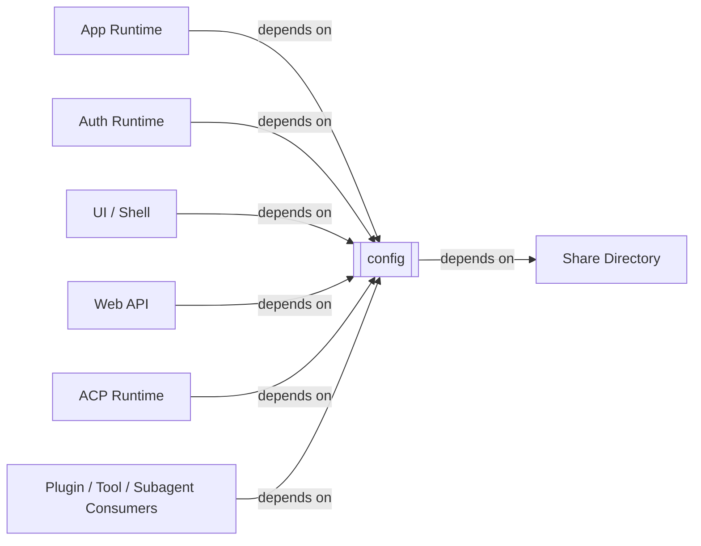
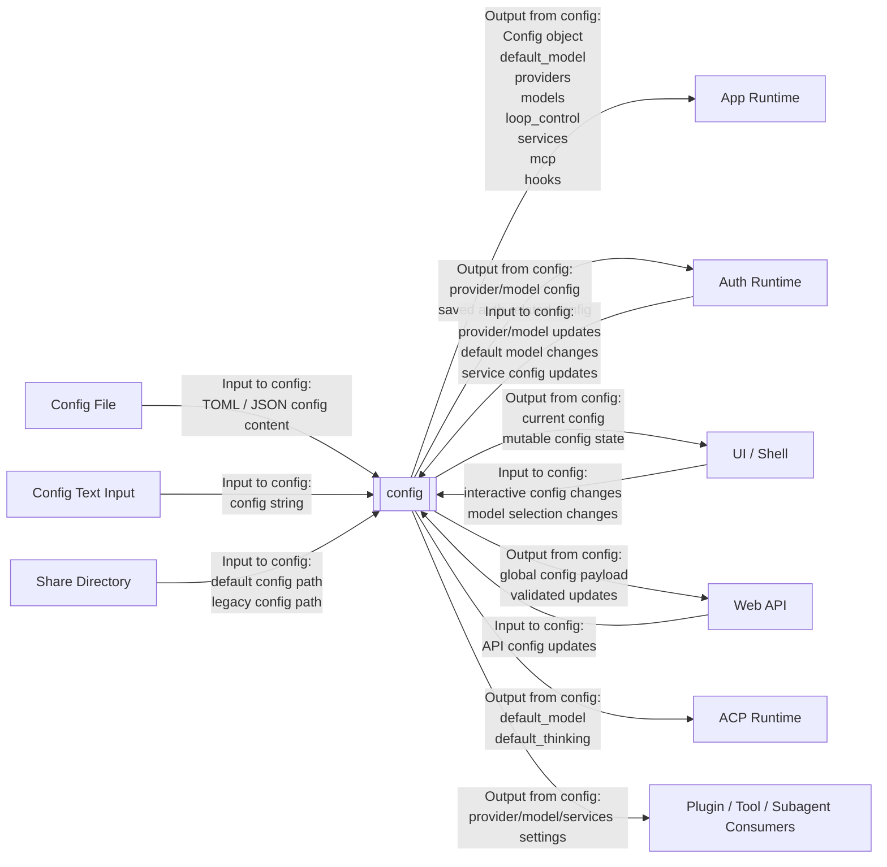

# Kimi CLI Config System Context

## Scope

本文档将 `kimi-cli` 的 `config` 视为一个黑盒系统，分析它的外部对象、依赖关系与信息流关系。

这里的 `config` 黑盒主要对应：

- [config.py](/home/dev/workspace/kimi-cli/src/kimi_cli/config.py)

本文不展开配置对象内部字段实现细节，也不展开 `llm` 的 provider 实例化逻辑。  
关注点是：

- 哪些外部对象依赖 `config`
- 哪些外部对象向 `config` 提供输入
- `config` 向哪些外部对象输出什么信息

## External Entities

`config` 黑盒的主要外部对象包括：

- `Config File`
  - 默认配置文件或显式指定配置文件
  - 当前主要承载 `config.toml`，兼容 legacy `config.json`

- `Config Text Input`
  - 通过字符串直接提供的 TOML / JSON 配置文本

- `Share Directory`
  - 提供默认配置文件位置与 legacy 配置迁移位置

- `Environment Override Context`
  - 严格来说环境变量主要由 `llm` 消费
  - 但 `config` 负责输出会被环境覆盖的 provider/model 基础配置

- `App Runtime`
  - 例如 `KimiCLI.create(...)`
  - 从 `config` 获取 provider/model/default 行为/loop control 等全局配置

- `Auth Runtime`
  - 登录、登出、平台模型同步等流程会读写 `config`

- `UI / Shell`
  - shell setup、slash commands、oauth UI 会读取并修改配置

- `Web API`
  - web 配置接口会读取、验证并持久化全局配置

- `ACP Runtime`
  - ACP server 会读取默认模型与默认 thinking 等配置

- `Plugin / Tool / Subagent Consumers`
  - 插件、工具、subagent 构建逻辑会读取默认模型、provider、services 等配置

## Dependency Relations

本节只描述依赖关系，不描述运行时信息是否真的流过该边界。

### Share Directory -> config

`config` 依赖共享目录位置来确定默认配置文件路径。

代码证据：

- [config.py](/home/dev/workspace/kimi-cli/src/kimi_cli/config.py#L224) `get_config_file()`
- [config.py](/home/dev/workspace/kimi-cli/src/kimi_cli/config.py#L22) `get_share_dir`

### App / Auth / UI / Web / ACP / Plugin -> config

这些模块都直接依赖 `config` 作为统一配置边界。

代码证据包括：

- [app.py](/home/dev/workspace/kimi-cli/src/kimi_cli/app.py#L135) 调用 `load_config(...)`
- [ui/shell/setup.py](/home/dev/workspace/kimi-cli/src/kimi_cli/ui/shell/setup.py#L143) 调用 `load_config()`
- [ui/shell/slash.py](/home/dev/workspace/kimi-cli/src/kimi_cli/ui/shell/slash.py#L249) 调用 `load_config()`
- [web/api/config.py](/home/dev/workspace/kimi-cli/src/kimi_cli/web/api/config.py#L78) 调用 `load_config()`
- [acp/server.py](/home/dev/workspace/kimi-cli/src/kimi_cli/acp/server.py#L162) 读取 `config.default_model`
- [plugin/manager.py](/home/dev/workspace/kimi-cli/src/kimi_cli/plugin/manager.py#L41) 读取默认模型配置

## Information Flow Relations

本节只描述 `config` 黑盒边界上的信息输入与信息输出。

### Config File <-> config

`Config File` 是 `config` 黑盒最直接的输入输出边界。

进入 `config` 的信息包括：

- TOML 配置文本
- JSON 配置文本
- legacy 配置文件内容

从 `config` 输出到文件边界的信息包括：

- 规范化后的配置对象持久化结果
- 默认配置文件初始化内容
- legacy JSON 迁移后的 TOML 内容

代码证据：

- [config.py](/home/dev/workspace/kimi-cli/src/kimi_cli/config.py#L239) `load_config(...)`
- [config.py](/home/dev/workspace/kimi-cli/src/kimi_cli/config.py#L323) `save_config(...)`
- [config.py](/home/dev/workspace/kimi-cli/src/kimi_cli/config.py#L341) `_migrate_json_config_to_toml()`

### Config Text Input -> config

`config` 也支持直接从字符串加载配置。

进入 `config` 的信息包括：

- TOML 字符串
- JSON 字符串

`config` 向外输出的信息包括：

- 校验后的 `Config` 对象
- `ConfigError`

代码证据：

- [config.py](/home/dev/workspace/kimi-cli/src/kimi_cli/config.py#L290) `load_config_from_string(...)`

### Share Directory -> config

`Share Directory` 为 `config` 提供默认路径信息，而不是业务配置值。

进入 `config` 的信息包括：

- 默认配置文件路径
- legacy 配置文件路径
- 配置持久化目录位置

`config` 向共享目录相关边界输出的信息包括：

- 新建的默认配置文件
- 迁移后的 TOML 配置文件
- legacy JSON 备份文件

### App Runtime <-> config

`App Runtime` 是 `config` 的核心消费者之一。

进入 `config` 的信息包括：

- 可选的显式配置路径
- 启动参数触发的配置覆盖意图

`config` 向 `App Runtime` 输出的信息包括：

- `Config`
- 默认模型选择
- provider 配置
- loop control 配置
- background / notification / hook / service 配置

代码证据：

- [app.py](/home/dev/workspace/kimi-cli/src/kimi_cli/app.py#L135)
- [app.py](/home/dev/workspace/kimi-cli/src/kimi_cli/app.py#L150)

### Auth Runtime <-> config

`Auth Runtime` 会直接读写配置中的 provider、model、service 相关内容。

进入 `config` 的信息包括：

- 新 provider 记录
- 新 model 记录
- 默认模型变更
- Moonshot service 配置变更
- provider / model 删除动作

`config` 向 `Auth Runtime` 输出的信息包括：

- 当前 provider 配置
- 当前 model 配置
- 默认模型配置
- 持久化后的配置状态

这说明 `config` 不只是只读配置仓库，同时也是认证流程的状态更新边界之一。

### UI / Shell <-> config

`UI / Shell` 会读取配置用于展示、选择与运行，也会将交互修改写回配置。

进入 `config` 的信息包括：

- 用户通过 slash/setup 触发的模型切换
- 默认模型更新
- 平台设置变更

`config` 向 `UI / Shell` 输出的信息包括：

- 当前默认模型
- provider/model 列表
- theme / default editor / default thinking / yolo 等全局设置

### Web API <-> config

`Web API` 把 `config` 暴露为可读写的远程管理边界。

进入 `config` 的信息包括：

- API 请求中的配置更新字段

`config` 向 `Web API` 输出的信息包括：

- 当前全局配置视图
- 更新后配置
- 校验错误

### ACP Runtime <- config

`ACP Runtime` 主要从 `config` 读取默认模型和默认 thinking 等全局默认值。

`config` 向 `ACP Runtime` 输出的信息包括：

- `default_model`
- `default_thinking`
- 相关模型配置

当前这层边界主要体现为读取，不是主要写入边界。

### Plugin / Tool / Subagent Consumers <- config

插件、工具与 subagent 相关逻辑会消费 `config` 输出的 provider/model/services 信息。

`config` 向这些消费者输出的信息包括：

- 默认模型选择
- provider 配置
- service 配置
- 与运行时装配有关的配置对象

## Boundary Notes

下列内容不属于本文范围：

- provider API 的具体实例化逻辑
- OAuth token 的实际解析与刷新逻辑
- 环境变量如何覆盖 provider/model 参数
- `llm` 黑盒如何把配置变成实际 chat provider

这些内容应放在后续 `llm` 黑盒分析中处理。
