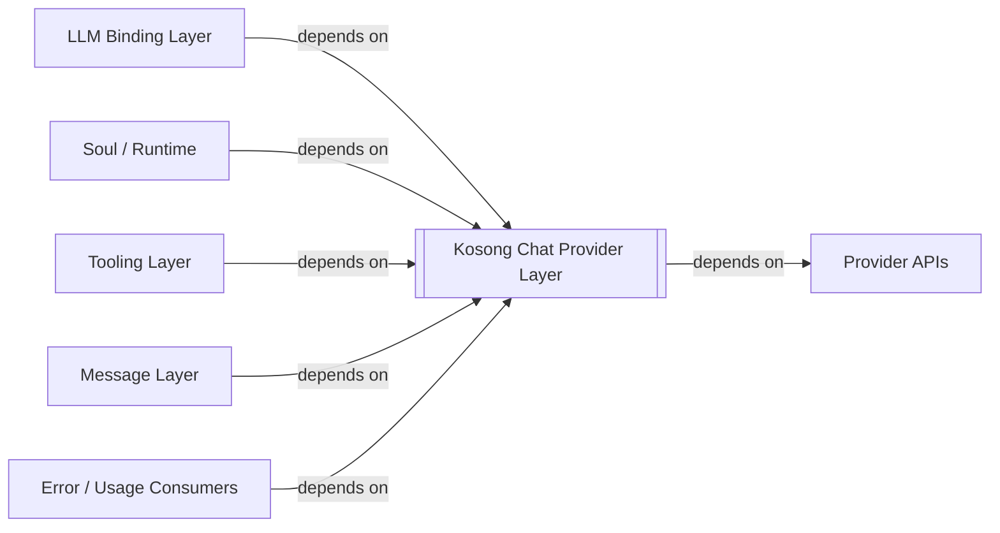
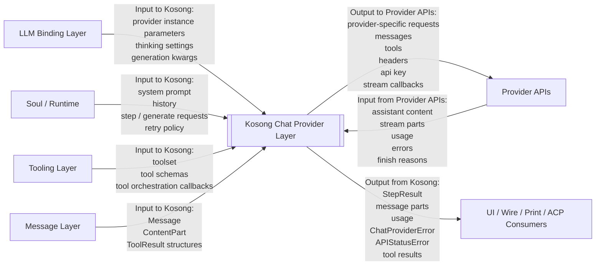

# Kimi CLI Kosong Chat Provider Layer System Context

## Scope

本文档将 `Kosong Chat Provider Layer` 视为 `kimi-cli` 内部的一个黑盒系统，分析它的外部对象、依赖关系与信息流关系。

这里的黑盒主要对应：

- `kosong.chat_provider`
- `kosong.contrib.chat_provider.*`
- `ChatProvider` 抽象及各 provider adapter

从 `kimi-cli` 视角看，这一层位于：

- 上游：`llm`、`soul/runtime`
- 下游：外部 `Provider APIs`

它的职责不是决定“用哪个模型”，而是把内部统一调用语义落实为具体 provider 实例与 provider 请求行为。

## External Entities

`Kosong Chat Provider Layer` 的主要外部对象包括：

- `LLM Binding Layer`
  - 向 Kosong 提供 provider/model/base_url/api_key/thinking 等构造输入

- `Soul / Runtime`
  - 直接使用 `ChatProvider`、`RetryableChatProvider`、`generate`、`step` 等能力执行对话与工具循环

- `Tooling Layer`
  - 通过 Kosong 的 tool orchestration 抽象参与模型调用

- `Message Layer`
  - 向 Kosong 提供统一 message / content part 结构

- `Provider APIs`
  - Kimi、OpenAI、Anthropic、Gemini、Vertex AI 等外部模型服务

- `Error / Usage Consumers`
  - UI、print、wire、acp 等上层模块会消费由 Kosong 产生或包装的 provider error 与 usage 信息

## Dependency Relations

本节只描述依赖关系，不描述运行时信息是否真的流过该边界。

### LLM / Soul / Tooling / Message / Error Consumers -> Kosong

`kimi-cli` 上层多个模块都直接依赖 Kosong。

代码证据包括：

- [llm.py](/home/dev/workspace/kimi-cli/src/kimi_cli/llm.py#L9) `ChatProvider`
- [soul/kimisoul.py](/home/dev/workspace/kimi-cli/src/kimi_cli/soul/kimisoul.py#L13) `StepResult`
- [soul/kimisoul.py](/home/dev/workspace/kimi-cli/src/kimi_cli/soul/kimisoul.py#L14) `RetryableChatProvider`
- [wire/server.py](/home/dev/workspace/kimi-cli/src/kimi_cli/wire/server.py#L10) `APIStatusError`, `ChatProviderError`
- [ui/print/__init__.py](/home/dev/workspace/kimi-cli/src/kimi_cli/ui/print/__init__.py#L9) provider error types
- [tools/*](/home/dev/workspace/kimi-cli/src/kimi_cli/tools) 中大量 `kosong.tooling` 依赖

### Kosong -> Provider APIs

Kosong 直接依赖外部 provider API，并对其进行适配。

README 证据：

- [packages/kosong/README.md](/home/dev/workspace/kimi-cli/packages/kosong/README.md)

代码证据：

- [llm.py](/home/dev/workspace/kimi-cli/src/kimi_cli/llm.py#L127) `Kimi`
- [llm.py](/home/dev/workspace/kimi-cli/src/kimi_cli/llm.py#L149) `OpenAILegacy`
- [llm.py](/home/dev/workspace/kimi-cli/src/kimi_cli/llm.py#L157) `OpenAIResponses`
- [llm.py](/home/dev/workspace/kimi-cli/src/kimi_cli/llm.py#L165) `Anthropic`
- [llm.py](/home/dev/workspace/kimi-cli/src/kimi_cli/llm.py#L175) `GoogleGenAI`

## Information Flow Relations

本节只描述 `Kosong Chat Provider Layer` 黑盒边界上的信息输入与信息输出。

### LLM Binding Layer -> Kosong

`llm` 黑盒向 Kosong 输出 provider binding 结果。

进入 Kosong 的信息包括：

- 具体 `ChatProvider` 构造参数
- `thinking` 设置
- generation kwargs
- base_url
- api_key
- headers
- metadata

Kosong 向上层返回的信息包括：

- `ChatProvider`
- 带 provider 特性的可调用对象

### Soul / Runtime -> Kosong

Kosong 是上层对话与工具循环执行的关键承载层。

进入 Kosong 的信息包括：

- system prompt
- 历史消息
- 调用模式，例如 `generate` / `step`
- 可能的 retry 行为

Kosong 向上层输出的信息包括：

- `StepResult`
- assistant message
- streamed message parts
- token usage
- provider errors

README 证据：

- [packages/kosong/README.md](/home/dev/workspace/kimi-cli/packages/kosong/README.md)

### Tooling Layer -> Kosong

Kosong 承接工具定义与工具调用编排。

进入 Kosong 的信息包括：

- toolset
- callable tools
- tool schemas
- tool return values

Kosong 向上层输出的信息包括：

- tool call 请求结果
- tool result 聚合
- step 结果中的工具执行产物

### Message Layer -> Kosong

Kosong 依赖统一消息结构作为输入。

进入 Kosong 的信息包括：

- `Message`
- `ContentPart`
- `ToolResult`

Kosong 向调用方输出的信息包括：

- 标准化消息结果
- streamed message part
- usage 与错误对象

### Kosong <-> Provider APIs

Kosong 与外部 provider API 之间存在最关键的运行时信息流。

进入 `Provider APIs` 的信息包括：

- provider-specific request payload
- messages / prompt context
- tool schema
- headers
- api key
- stream callback / request mode

`Provider APIs` 向 Kosong 返回的信息包括：

- assistant 内容
- stream parts
- usage
- finish reason
- provider-specific errors

### Kosong -> UI / Wire / Print / ACP Consumers

这些模块通常不直接面向 provider API，而是消费 Kosong 产出的结果与错误。

Kosong 向这些消费者输出的信息包括：

- `ChatProviderError`
- `APIStatusError`
- `TokenUsage`
- message / content structures
- tool result structures

## Boundary Notes

下列内容不属于本文范围：

- `llm` 如何决定 provider type 与 model
- `config` 如何加载 provider/model 配置
- `soul` 如何驱动完整 agent loop
- 外部 provider API 各自协议细节

这些内容应分别在 `llm`、`config`、`runtime` 与 `Provider APIs` 文档中分析。
