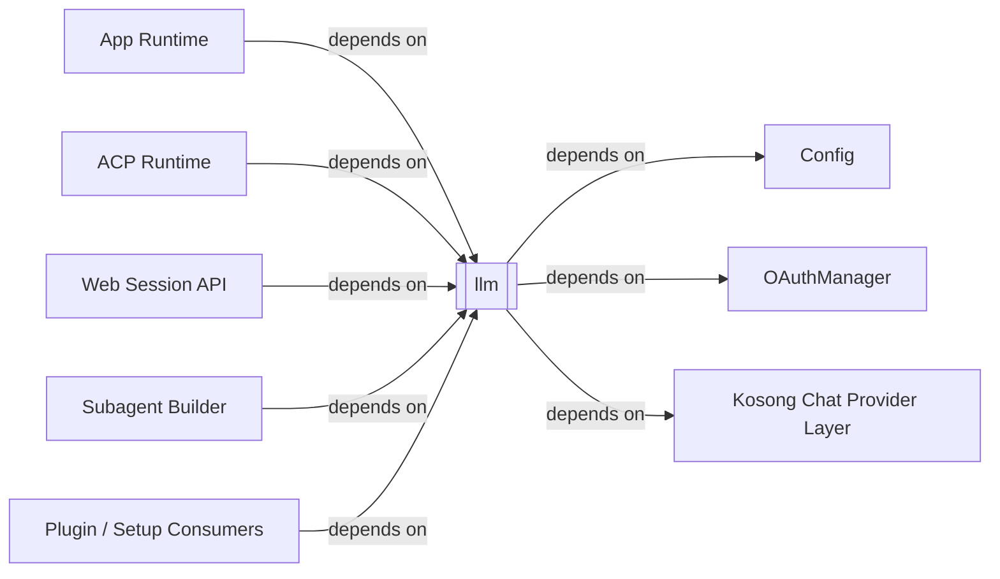
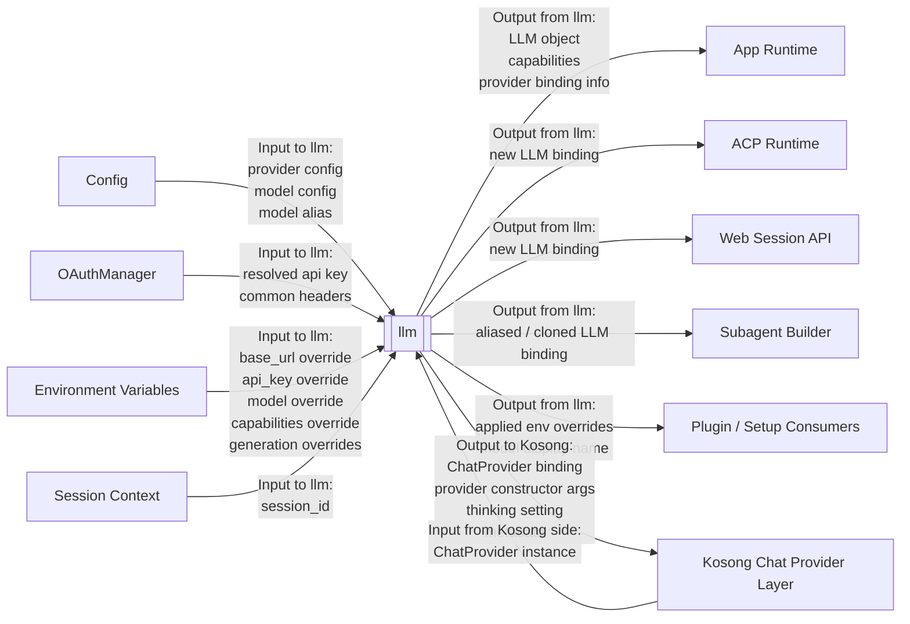

# Kimi CLI LLM Binding System Context

## Scope

本文档将 `kimi-cli` 的 `llm` 视为一个黑盒系统，分析它的外部对象、依赖关系与信息流关系。

这里的 `llm` 黑盒主要对应：

- [llm.py](/home/dev/workspace/kimi-cli/src/kimi_cli/llm.py)

在当前分层中，`llm` 更准确的角色不是“直接访问模型 API 的执行层”，而是：

- `LLM Binding Layer`
- `LLM Factory Layer`

也就是说，它的核心职责是把配置、认证、环境变量与会话参数绑定成一个可运行的 `LLM` 对象。

## External Entities

`llm` 黑盒的主要外部对象包括：

- `Config`
  - 提供 `LLMProvider`、`LLMModel`、model alias 等结构化输入

- `OAuthManager`
  - 提供认证解析与公共请求头输入

- `Environment Variables`
  - 提供 provider/model/base_url/api_key/capabilities 以及 generation 参数覆盖

- `Session Context`
  - 主要体现为 `session_id`
  - 用于 prompt cache key、user metadata 等会话级绑定

- `App Runtime`
  - 启动流程中直接调用 `augment_provider_with_env_vars(...)` 与 `create_llm(...)`

- `ACP Runtime`
  - 会在模型切换时重新构造新的 `LLM`

- `Web Session API`
  - 会在 session 建立流程中直接构造 `LLM`

- `Subagent Builder`
  - 会基于 model alias 克隆或切换 `LLM`

- `Plugin / Setup Consumers`
  - 某些流程只消费环境变量覆盖结果或模型展示逻辑

- `Kosong Chat Provider Layer`
  - `llm` 的直接下游运行时黑盒
  - `llm` 输出的核心结果之一就是基于 Kosong provider 的 `ChatProvider` 绑定

## Dependency Relations

本节只描述依赖关系，不描述运行时信息是否真的流过该边界。

### Config -> llm

`llm` 直接依赖 `Config` 提供的 provider/model 配置。

代码证据：

- [llm.py](/home/dev/workspace/kimi-cli/src/kimi_cli/llm.py#L16)
- [llm.py](/home/dev/workspace/kimi-cli/src/kimi_cli/llm.py#L106) `create_llm(...)`
- [llm.py](/home/dev/workspace/kimi-cli/src/kimi_cli/llm.py#L240) `clone_llm_with_model_alias(...)`

### OAuthManager -> llm

`llm` 直接依赖 `OAuthManager` 完成 API key 解析与 Kimi 公共 header 注入。

代码证据：

- [llm.py](/home/dev/workspace/kimi-cli/src/kimi_cli/llm.py#L97) `_kimi_default_headers(...)`
- [llm.py](/home/dev/workspace/kimi-cli/src/kimi_cli/llm.py#L119) `oauth.resolve_api_key(...)`

### Kosong Chat Provider Layer <- llm

`llm` 直接依赖 Kosong 的 provider 抽象与 provider 实现，用于构造 `ChatProvider`。

代码证据：

- [llm.py](/home/dev/workspace/kimi-cli/src/kimi_cli/llm.py#L9) `ChatProvider`
- [llm.py](/home/dev/workspace/kimi-cli/src/kimi_cli/llm.py#L127) `Kimi`
- [llm.py](/home/dev/workspace/kimi-cli/src/kimi_cli/llm.py#L149) `OpenAILegacy`
- [llm.py](/home/dev/workspace/kimi-cli/src/kimi_cli/llm.py#L157) `OpenAIResponses`
- [llm.py](/home/dev/workspace/kimi-cli/src/kimi_cli/llm.py#L165) `Anthropic`
- [llm.py](/home/dev/workspace/kimi-cli/src/kimi_cli/llm.py#L175) `GoogleGenAI`

### App / ACP / Web / Subagent / Plugin -> llm

这些模块都把 `llm` 作为模型绑定入口，而不是 provider 协议入口。

代码证据包括：

- [app.py](/home/dev/workspace/kimi-cli/src/kimi_cli/app.py#L166)
- [app.py](/home/dev/workspace/kimi-cli/src/kimi_cli/app.py#L174)
- [acp/server.py](/home/dev/workspace/kimi-cli/src/kimi_cli/acp/server.py#L346)
- [web/api/sessions.py](/home/dev/workspace/kimi-cli/src/kimi_cli/web/api/sessions.py#L999)
- [subagents/builder.py](/home/dev/workspace/kimi-cli/src/kimi_cli/subagents/builder.py#L20)
- [cli/plugin.py](/home/dev/workspace/kimi-cli/src/kimi_cli/cli/plugin.py#L210)

## Information Flow Relations

本节只描述 `llm` 黑盒边界上的信息输入与信息输出。

### Config -> llm

`Config` 是 `llm` 黑盒最核心的结构化输入来源。

进入 `llm` 的信息包括：

- `LLMProvider`
- `LLMModel`
- model alias
- provider type
- 初始 capabilities

`llm` 向外输出的信息包括：

- 基于配置构造的 `LLM`
- 推导后的 capabilities
- provider/model 绑定结果

### OAuthManager -> llm

`OAuthManager` 向 `llm` 提供认证与头信息输入。

进入 `llm` 的信息包括：

- resolved api key
- 公共 headers

`llm` 向外输出的信息包括：

- 带认证信息的 provider 构造参数

### Environment Variables -> llm

环境变量是 `llm` 的关键运行时输入边界之一。

进入 `llm` 的信息包括：

- `KIMI_BASE_URL`
- `KIMI_API_KEY`
- `KIMI_MODEL_NAME`
- `KIMI_MODEL_MAX_CONTEXT_SIZE`
- `KIMI_MODEL_CAPABILITIES`
- `KIMI_MODEL_TEMPERATURE`
- `KIMI_MODEL_TOP_P`
- `KIMI_MODEL_MAX_TOKENS`
- `OPENAI_BASE_URL`
- `OPENAI_API_KEY`

`llm` 向调用方输出的信息包括：

- 哪些环境变量覆盖被应用
- 覆盖后的 provider/model 配置
- 基于覆盖结果构造出的 `LLM`

代码证据：

- [llm.py](/home/dev/workspace/kimi-cli/src/kimi_cli/llm.py#L56) `augment_provider_with_env_vars(...)`
- [llm.py](/home/dev/workspace/kimi-cli/src/kimi_cli/llm.py#L136) `gen_kwargs`

### Session Context -> llm

`session_id` 是 `llm` 的会话级输入。

进入 `llm` 的信息包括：

- `session_id`

`llm` 向下游 provider binding 输出的信息包括：

- prompt cache key
- user metadata

代码证据：

- [llm.py](/home/dev/workspace/kimi-cli/src/kimi_cli/llm.py#L137)
- [llm.py](/home/dev/workspace/kimi-cli/src/kimi_cli/llm.py#L172)

### App Runtime <-> llm

`App Runtime` 是 `llm` 的核心调用方之一。

进入 `llm` 的信息包括：

- provider/model 配置
- thinking 开关
- session_id
- oauth

`llm` 向 `App Runtime` 输出的信息包括：

- `LLM | None`
- applied env overrides
- model display name

代码证据：

- [app.py](/home/dev/workspace/kimi-cli/src/kimi_cli/app.py#L166)
- [app.py](/home/dev/workspace/kimi-cli/src/kimi_cli/app.py#L174)
- [app.py](/home/dev/workspace/kimi-cli/src/kimi_cli/app.py#L474)

### ACP Runtime <-> llm

`ACP Runtime` 会根据模型切换结果重新绑定 `LLM`。

进入 `llm` 的信息包括：

- provider/model
- thinking 配置
- oauth

`llm` 向 `ACP Runtime` 输出的信息包括：

- 新的 `LLM`

### Web Session API <-> llm

Web 会话建立流程也会直接请求新的 `LLM` 绑定。

进入 `llm` 的信息包括：

- provider 配置
- model 配置
- oauth

`llm` 向 `Web Session API` 输出的信息包括：

- `LLM`
- provider 绑定结果

### Subagent Builder <-> llm

`Subagent Builder` 通过 model alias 切换或克隆 `LLM`。

进入 `llm` 的信息包括：

- 当前 `LLM`
- `Config`
- model alias
- session_id
- oauth

`llm` 向 `Subagent Builder` 输出的信息包括：

- alias 解析后的新 `LLM`

代码证据：

- [llm.py](/home/dev/workspace/kimi-cli/src/kimi_cli/llm.py#L240) `clone_llm_with_model_alias(...)`

### Plugin / Setup Consumers <- llm

某些流程不会直接消费完整 provider 协议，而是消费 `llm` 输出的辅助结果。

`llm` 向这些消费者输出的信息包括：

- env override 结果
- 模型显示名
- provider/model 绑定辅助信息

### Kosong Chat Provider Layer <-> llm

`llm` 的直接运行时输出对象是 `Kosong Chat Provider Layer`。

`llm` 向 Kosong 输出的信息包括：

- 具体 provider 构造参数
- `ChatProvider`
- thinking 设置
- generation kwargs
- metadata

Kosong 向 `llm` 这一边界返回的主要是：

- 已绑定的 provider 实例能力

需要注意：

- `llm` 到此为止只负责“绑定”
- 之后真正的 provider request / response 交互发生在 `Kosong Chat Provider Layer` 与 `Provider APIs` 之间

## Boundary Notes

下列内容不属于本文范围：

- provider request / response 的具体协议
- 外部 `Provider APIs` 的流式输出与错误语义
- `soul/runtime` 如何消费 `LLM`
- `config` 如何加载与持久化 provider/model 配置

这些内容应分别在 `Kosong Chat Provider Layer`、`Provider APIs`、`runtime` 与 `config` 文档中分析。
