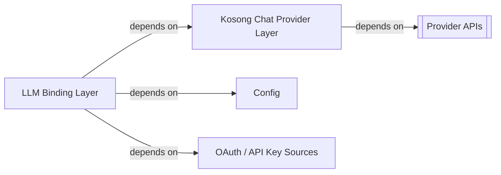
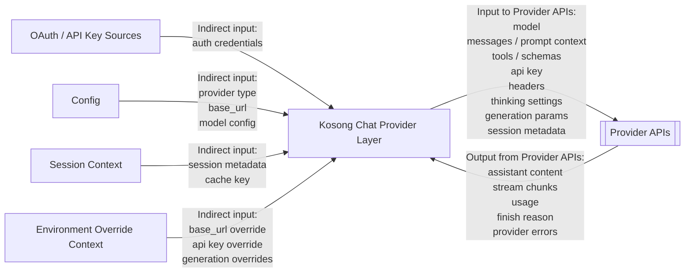

# Kimi CLI Provider APIs System Context

## Scope

本文档将 `Provider APIs` 视为 `kimi-cli` 之外的外部黑盒系统，分析它们与 `kimi-cli` 内部模型接入层之间的关系。

这里的 `Provider APIs` 指外部模型服务接口，而不是 `kimi-cli` 内部代码模块。

当前已明确涉及的 provider API 类型包括：

- `kimi`
- `openai-legacy`
- `openai-responses`
- `anthropic`
- `gemini`
- `vertexai`

其中 `_echo`、`_scripted_echo`、`_chaos` 更偏本地测试或模拟 provider，不属于真正的外部 provider API。

## External Entities

把 `Provider APIs` 作为黑盒时，它的主要外部对象包括：

- `Kosong Chat Provider Layer`
  - `kimi-cli` 内部直接与 provider API 对接的适配层

- `LLM Binding Layer`
  - 即 `llm` 黑盒
  - 它不直接面向 provider API 协议细节，但决定 provider/model/auth 等输入

- `Config`
  - 间接提供 provider type、base_url、model、capabilities 等配置

- `OAuth / API Key Sources`
  - 提供认证信息

- `Session Context`
  - 提供 session 级元数据，例如 cache key、user metadata

- `Environment Override Context`
  - 提供 base_url、api_key、generation kwargs 等覆盖参数

## Dependency Relations

本节只描述依赖关系，不描述运行时信息是否真的流过该边界。

### Kosong Chat Provider Layer -> Provider APIs

这是最直接的依赖关系。

`kimi-cli` 并不自己实现 provider 协议细节，而是通过 `Kosong Chat Provider Layer` 依赖各家 provider API。

代码证据：

- [llm.py](/home/dev/workspace/kimi-cli/src/kimi_cli/llm.py#L125) `match provider.type`
- [llm.py](/home/dev/workspace/kimi-cli/src/kimi_cli/llm.py#L127) `Kimi`
- [llm.py](/home/dev/workspace/kimi-cli/src/kimi_cli/llm.py#L149) `OpenAILegacy`
- [llm.py](/home/dev/workspace/kimi-cli/src/kimi_cli/llm.py#L157) `OpenAIResponses`
- [llm.py](/home/dev/workspace/kimi-cli/src/kimi_cli/llm.py#L165) `Anthropic`
- [llm.py](/home/dev/workspace/kimi-cli/src/kimi_cli/llm.py#L175) `GoogleGenAI`

## Information Flow Relations

本节只描述 `Provider APIs` 黑盒边界上的信息输入与信息输出。

### Kosong Chat Provider Layer <-> Provider APIs

这是 `Provider APIs` 最核心的信息流关系。

进入 `Provider APIs` 的信息包括：

- model 标识
- prompt / messages / context
- tool schema 或 function/tool calling 信息
- api key
- headers
- thinking / reasoning 设置
- generation 参数，例如 `temperature`、`top_p`、`max_tokens`
- session 级 metadata

`Provider APIs` 向内部返回的信息包括：

- assistant 内容
- 流式响应块
- usage
- finish reason
- provider error

### Config / OAuth / Session / Environment -> Provider APIs

这些对象通常不会直接调用 provider API，但它们会通过内部接入层间接影响进入 `Provider APIs` 的请求。

具体来说：

- `Config` 决定 provider type、base_url、model 与部分能力声明
- `OAuth / API Key Sources` 决定认证信息
- `Session Context` 决定 cache key 或 metadata
- `Environment Override Context` 决定 base_url / api_key / generation 参数覆盖

因此，它们更适合在系统环境图中被标记为“间接输入来源”。

## Provider Family Notes

从 `kimi-cli` 当前代码和文档看，provider API 可分为几类：

- `kimi`
  - Kimi API
  - 可能带有 Kimi 平台特定 headers 与 prompt cache key

- `openai-legacy`
  - OpenAI Chat Completions 风格 API

- `openai-responses`
  - OpenAI Responses 风格 API

- `anthropic`
  - Anthropic Claude API

- `gemini`
  - Google Gemini API

- `vertexai`
  - Google Vertex AI

代码证据：

- [llm.py](/home/dev/workspace/kimi-cli/src/kimi_cli/llm.py#L18) `ProviderType`
- [providers.md](/home/dev/workspace/kimi-cli/docs/en/configuration/providers.md)

## Boundary Notes

下列内容不属于本文范围：

- `kimi-cli` 内部如何选择 provider
- provider 绑定对象如何在内部被消费
- `Kosong Chat Provider Layer` 的内部实现细节
- 上层 agent/runtime 如何消费 provider 返回结果

这些内容应分别在 `llm`、`Kosong Chat Provider Layer`、`app/runtime` 文档中分析。
