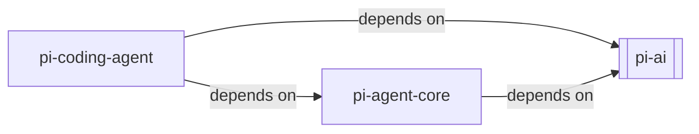
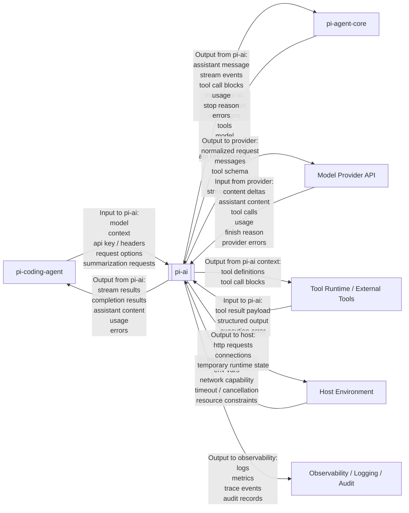

# PI-AI System Context

## Scope

本文档将 `pi-ai` 视为一个黑盒系统，描述其外部对象、依赖关系与信息流关系。

本文档不展开 `pi-ai` 内部模块划分、内部状态机、内部类设计或具体 provider 实现细节。  
本文只回答三个问题：

- `pi-ai` 的外部对象有哪些
- 哪些对象对 `pi-ai` 存在依赖关系
- 哪些对象与 `pi-ai` 存在信息输入输出关系

## External Entities

`pi-ai` 的外部对象可列为以下几类：

- `pi-agent-core`
  - `pi-ai` 的直接上层运行时内核
  - 负责组织 `systemPrompt`、`messages`、`tools`、`model`、`streaming` 与 tool loop

- `pi-coding-agent`
  - 面向 coding 场景的上层装配系统
  - 负责 session、tool set、settings、compaction、扩展机制与交互场景

- `Model Provider API`
  - `pi-ai` 访问的外部模型服务
  - 例如 OpenAI、Anthropic、Google、Kimi 等 provider API

- `Tool Runtime / External Tools`
  - 通过 tool call 间接与 `pi-ai` 相关联的外部工具执行环境
  - `pi-ai` 不直接执行工具本体，但会承接工具定义与工具调用结果

- `Host Environment`
  - `pi-ai` 运行所在的宿主环境
  - 提供环境变量、网络能力、超时与取消信号、进程资源边界

- `Observability / Logging / Audit`
  - 与 `pi-ai` 运行结果相关的外围可观测系统
  - 承接日志、指标、trace 与审计记录

## Dependency Relations

本节只描述依赖关系，不描述运行时信息是否真的流过该边界。

### pi-agent-core -> pi-ai

这是明确的直接依赖关系。

证据包括：

- `@mariozechner/pi-agent-core` 的 package 依赖直接包含 `@mariozechner/pi-ai`
- `pi-agent-core` 直接导入并使用 `getModel`、`streamSimple`、`validateToolArguments`、`EventStream`

因此，`pi-agent-core` 对 `pi-ai` 的关系不是抽象概念对齐，而是明确的代码依赖。

### pi-coding-agent -> pi-ai

这也是明确的直接依赖关系。

证据包括：

- `pi-coding-agent` 直接导入 `Message`、`Model`、`Context`、`streamSimple`、`completeSimple`
- `pi-coding-agent` 直接依赖 `pi-ai` 的模型注册、provider 注册、OAuth 注册、消息类型与流式调用能力

因此，`pi-coding-agent` 对 `pi-ai` 不是“仅通过 `pi-agent-core` 间接依赖”，而是存在独立的直接依赖。

### pi-coding-agent -> pi-agent-core

这同样是直接依赖关系。

`pi-coding-agent` 直接使用 `Agent`、`AgentMessage`、`ThinkingLevel` 等 `pi-agent-core` 能力来组织主对话循环与工具执行过程。

## Information Flow Relations

本节只描述 `pi-ai` 黑盒边界上的信息输入与信息输出。

### pi-agent-core <-> pi-ai

这是 `pi-ai` 最明确、最稳定的直接信息流关系之一。

`pi-agent-core` 向 `pi-ai` 输入的信息包括：

- `systemPrompt`
- `messages`
- `tools`
- `model`
- `thinking / stream options`
- `apiKey / headers`
- `signal`

`pi-ai` 向 `pi-agent-core` 输出的信息包括：

- assistant message
- assistant message event stream
- tool call 内容块
- usage
- stop reason
- error / aborted 结果

这层关系的语义是：

- `pi-agent-core` 组织一次 agent loop 所需的模型上下文
- `pi-ai` 负责把这次调用落到具体 provider，并返回统一流式结果

### pi-coding-agent <-> pi-ai

`pi-coding-agent` 与 `pi-ai` 之间也存在直接信息流关系，不能只看作类型依赖。

`pi-coding-agent` 向 `pi-ai` 输入的信息包括：

- 选定的 `model`
- 由 coding-agent 组装后的 `context`
- `apiKey / headers`
- request options
- 分支总结、压缩总结等附加模型请求

`pi-ai` 向 `pi-coding-agent` 输出的信息包括：

- stream result
- completion result
- assistant content
- usage
- error

这层关系在源码中有直接证据：

- `coding-agent/src/core/sdk.ts` 直接调用 `streamSimple`
- `coding-agent/src/core/compaction/branch-summarization.ts` 直接调用 `completeSimple`

因此，`pi-coding-agent` 不是只通过 `pi-agent-core` 间接接触 `pi-ai`，而是在部分路径上直接与 `pi-ai` 交换输入输出信息。

### Model Provider API <-> pi-ai

`pi-ai` 向 `Model Provider API` 输出的信息包括：

- 归一化后的请求 payload
- messages
- system prompt
- tool schema
- provider-specific options
- headers / auth

`Model Provider API` 向 `pi-ai` 输入的信息包括：

- 文本或内容块输出
- 流式 delta
- thinking / reasoning 信号
- tool call 请求
- usage
- finish reason
- provider error

这层关系定义了 `pi-ai` 作为统一模型接入层的核心价值：  
上游无需面向 provider 私有协议编程，而是只与 `pi-ai` 的统一语义交互。

### Tool Runtime / External Tools <-> pi-ai

从 `pi-ai` 黑盒边界看，工具关系主要体现为“工具定义进入模型上下文，工具结果返回到模型上下文”。

进入 `pi-ai` 的信息包括：

- tool result payload
- structured output
- execution error

从 `pi-ai` 输出到工具侧相关边界的信息包括：

- tool definitions
- tool call blocks
- tool arguments

这里要注意：

- 工具真正的执行编排通常发生在 `pi-agent-core` 或更上层
- 但工具语义本身仍然是 `pi-ai` 输入输出模型的一部分

### Host Environment <-> pi-ai

`Host Environment` 向 `pi-ai` 输入的信息包括：

- 环境变量
- 网络可达性
- timeout / cancellation
- 进程资源限制

`pi-ai` 向宿主环境输出的信息包括：

- 对外部 provider 的网络请求
- 连接占用
- 临时运行状态

### Observability / Logging / Audit <- pi-ai

该对象主要接收 `pi-ai` 的输出信息，包括：

- logs
- metrics
- traces
- audit records

它通常不向 `pi-ai` 提供业务级输入，因此这里以单向输出关系表达即可。

## Boundary Notes

下列内容属于 `pi-ai` 内部问题，不在本文讨论范围内：

- provider registry 的内部组织方式
- 消息对象与内容块对象的内部类型定义
- streaming event 的内部分发实现
- tool-call bridge 的内部状态机
- retry、fallback、cache 等内部策略细节

本文只要求回答一个问题：  
当把 `pi-ai` 看成黑盒时，哪些外部对象依赖它，哪些外部对象与它交换信息，以及这些信息如何进出 `pi-ai`。
