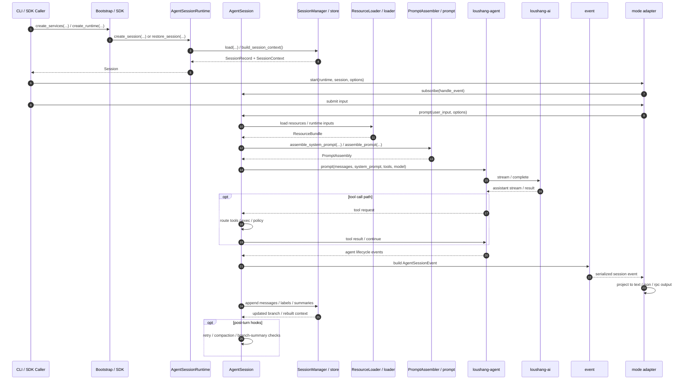
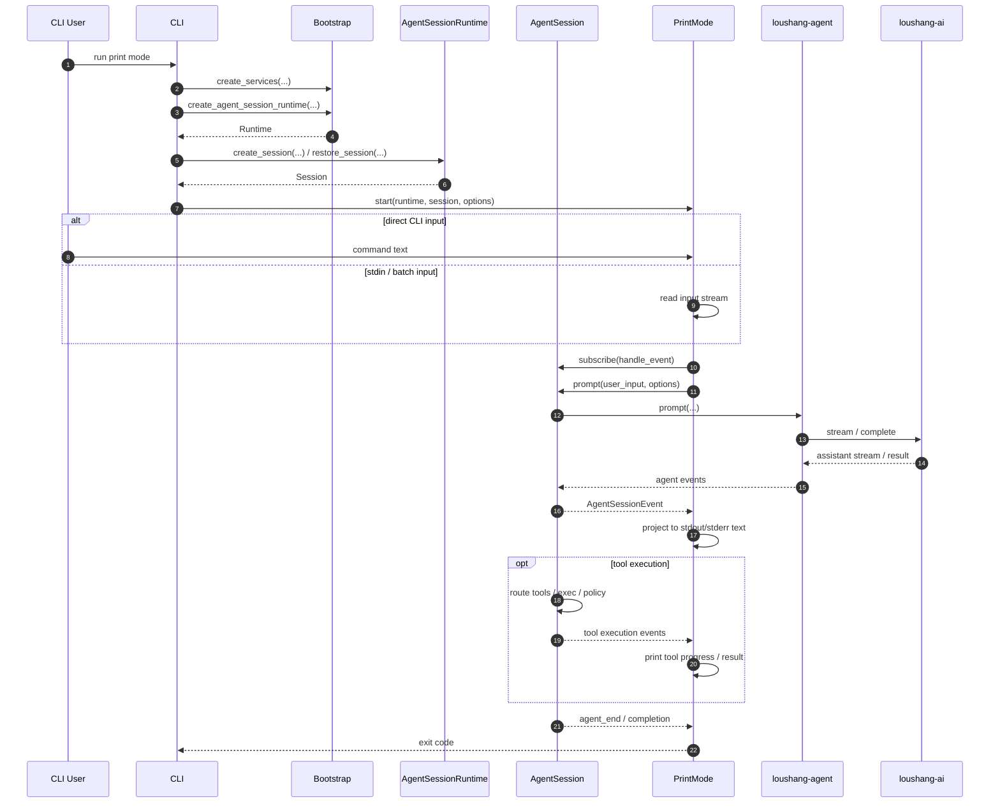
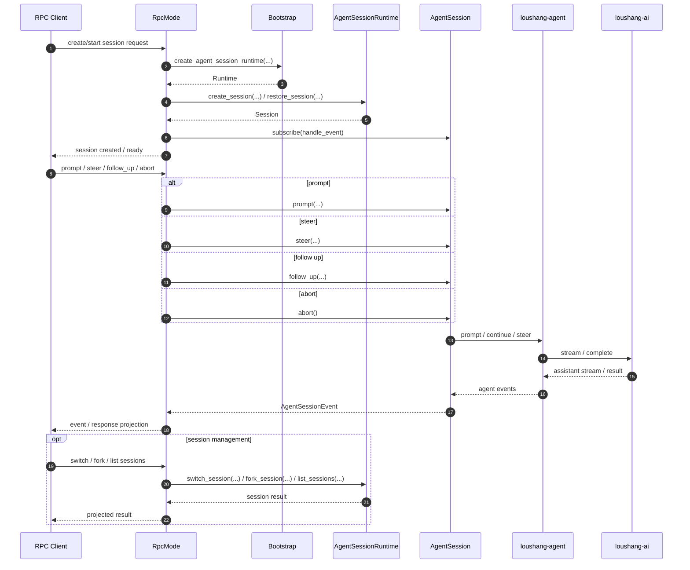
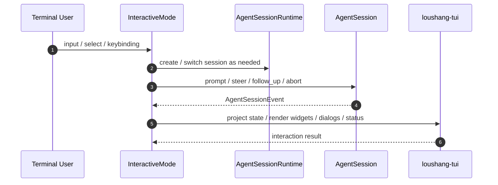

# Loushang Coding Key Mode Sequences

## Scope

本文档描述 `loushang-coding` 关键 mode 的运行时序。

本文档当前覆盖：

- `print mode`
- `json mode`
- `rpc mode`
- `interactive mode`（未来占位）

本文档目标是回答：

- 不同 mode 如何进入统一 runtime 主干
- mode 与 `AgentSessionRuntime` / `AgentSession` 如何协作
- 哪些时序应尽量对齐 `pi-coding-agent`
- 哪些地方是当前刻意保留的简化

本文档不展开：

- 字段级协议
- 详细 UI 行为
- channel 协议细节

## Design Basis

本文档建立在以下文档之上：

- [Loushang Coding System Context](/home/dev/workspace/loushang/docs/architecture/coding/loushang-coding-system-context.md)
- [Loushang Coding Component Interfaces](/home/dev/workspace/loushang/docs/architecture/coding/loushang-coding-component-interfaces.md)
- [Loushang Coding Component Dependencies](/home/dev/workspace/loushang/docs/architecture/coding/loushang-coding-component-dependencies.md)
- [pi-coding-agent Internal Dependency Overview](/home/dev/workspace/loushang/docs/architecture/coding/reference/pi-coding/architecture-dependencies.md)

## Shared Runtime Spine

当前所有 mode 都应尽量共享同一条主干：

```text
caller
  -> Bootstrap / SDK
  -> AgentSessionRuntime
  -> AgentSession
  -> loushang-agent
  -> loushang-ai
```

也就是说，mode 只是 I/O adapter，而不是另一套运行核心。

## Shared Core Component Sequence

如果把 `loushang-coding` 压成一轮最核心的组件时序，当前建议表达为：



### Reading Notes

- `session` 是核心业务编排中心
- `runtime` 只负责当前活动 session 生命周期，不负责 turn 内业务
- `mode` 只消费 `AgentSessionEvent` 并做输出投影
- `store` 负责持久化与 context rebuild，不负责 run-loop 决策
- `prompt`、`tools`、`exec`、`policy`、`compaction` 都应作为 `session` 的协作者出现，而不是替代 `session`

## 1. `print mode`

### Intent

- 面向终端文本输出
- 最小交互
- 单次执行或串行执行输入

### Sequence



### Reading Notes

- `print mode` 不应直接调用 `loushang-agent`
- `print mode` 只通过 `AgentSession` 驱动运行
- `print mode` 主要消费 `AgentSessionEvent` 并投影为文本

### Alignment With pi-coding-agent

- 对齐 `PrintMode` 作为 mode adapter 的定位
- 对齐“统一 session facade 驱动 runtime，再由 mode 投影输出”的主思路

## 2. `print mode` 的 JSON projection

### Intent

- 面向结构化输出
- 适合脚本、管道、自动化场景
- 与 `print mode` 共用相同 session 主干
- 当前应视为 `PrintMode` 的第二输出投影，而不是独立 adapter object

### Sequence

```mermaid
sequenceDiagram
  autonumber
  participant Caller as CLI / SDK caller
  participant Boot as Bootstrap
  participant Runtime as AgentSessionRuntime
  participant Session as AgentSession
  participant Print as PrintMode
  participant Agent as loushang-agent
  participant AI as loushang-ai

  Caller->>Boot: create_agent_session_runtime(...)
  Boot-->>Caller: Runtime
  Caller->>Runtime: create_session(...)
  Runtime-->>Caller: Session
  Caller->>Print: start(runtime, session, output_mode="json")

  Print->>Session: subscribe(handle_event)
  Caller->>Print: submit command
  Print->>Session: prompt(user_input, options)
  Session->>Agent: prompt(...)
  Agent->>AI: stream / complete
  AI-->>Agent: assistant stream / result
  Agent-->>Session: agent events
  Session-->>Print: AgentSessionEvent
  Print->>Print: project event to JSON records or final structured result

  opt final-only mode
    Print->>Print: emit final assistant payload only
  else streaming-json mode
    Print->>Print: emit event stream incrementally
  end

  Session-->>Print: completion
  Print-->>Caller: structured output + exit status
```

### Reading Notes

- `json` 与 `print` 的核心差别不在运行主干，而在输出投影
- 当前应把它建模为 `PrintMode(output_mode="json")`
- 用户层仍可保留 `json mode` 这一运行形态命名

### Alignment With pi-coding-agent

- 对齐 `pi` 中 `--mode json` 作为 `runPrintMode(...)` 的结构化输出分支
- 对齐的是“相同 session 主干，不同输出投影”这一点
- 当前不建议再引入独立 `JsonMode` service object

## 3. `rpc mode`

### Intent

- 作为远程调用或宿主接入的 mode
- 前期不要求先依赖 `loushang-channel`
- 先以 mode adapter 形态成立
- 在架构对象层可表示为 `RpcMode`，也可落成 `runRpcMode(...)` 一类入口

### Sequence



### Reading Notes

- `rpc mode` 是 mode adapter，不是另一套 runtime
- 当前阶段它不要求先依赖 `loushang-channel`
- 未来如果 `channel` 落地，`rpc mode` 可以改为承载 `channel` projection
- 这里的 `rpc mode` 首先表示运行形态，其次才是具体对象命名

### Alignment With pi-coding-agent

- 对齐 `rpc mode / rpc client` 作为 mode adapter 的定位
- 保留当前 `loushang` 的明确决定：
  - `channel` 有长期价值
  - 但不是 `rpc mode` 的前置实现条件

## 4. `interactive mode` (Future)

### Intent

- 面向 TUI 交互
- 未来依赖 `loushang-tui`
- 当前只保留架构时序占位

### Sequence



### Reading Notes

- `interactive mode` 将是未来最重的 mode
- 在对象层更直接对齐 `InteractiveMode` 这一 UI orchestration object
- 但它仍应：
  - 依赖 `AgentSessionRuntime`
  - 依赖 `AgentSession`
  - 订阅 `AgentSessionEvent`
  - 不绕过 session facade 直接驱动底层 runtime

### Alignment With pi-coding-agent

- 对齐 `InteractiveMode` 作为 UI orchestration layer
- 当前差异在于：
  - `pi` 依赖 `pi-tui`
  - `loushang` 未来可能依赖 `loushang-tui`（Textual-based）

## 5. Cross-Mode Invariants

当前建议把以下规则作为所有 mode 的共同约束：

1. mode 不直接驱动 `loushang-agent`
2. mode 不直接驱动 `loushang-ai`
3. mode 通过 `AgentSessionRuntime` 管理 session 生命周期
4. mode 通过 `AgentSession` 推进一次运行
5. mode 通过 `AgentSessionEvent` 获取运行时观察面

## 6. Strong Alignment With pi-coding-agent

当前时序设计中，最需要对齐 `pi-coding-agent` 的点是：

- `AgentSession` 是统一运行中心
- 不同 mode 共用同一 session 语义
- `InteractiveMode` / `PrintMode` / `RpcMode` 都只是适配层
- session event stream 是 mode 最重要的输入面

## 7. Current Simplifications

当前相对 `pi-coding-agent` 的简化主要包括：

- 还未展开 extension hook 时序
- 还未展开 compaction / retry / queue 的细粒度时序
- `interactive mode` 仅保留未来占位
- `rpc mode` 仍未接入 `channel`

## Next Step

基于当前关键 mode 时序，后续建议继续：

1. P0 实现切片
2. 第一批接口裁剪
3. `print/json/rpc` 的公共 mode base 设计
