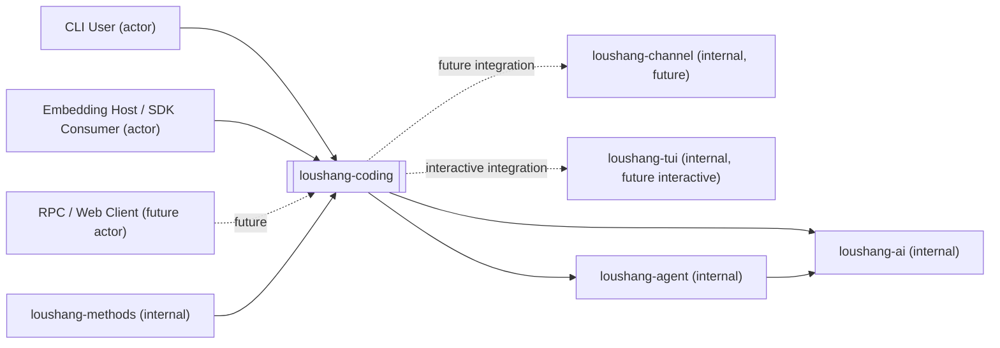

# Loushang Coding System Context

## Scope

本文档将 `loushang-coding` 视为一个黑盒子系统，描述它的外部子系统、依赖关系与信息流关系。

本文档目标是先确定 `loushang-coding` 的系统边界，为后续：

- 组件结构关系及职责
- 组件数据对象
- 组件接口
- 组件依赖关系

提供稳定落点。

本文不展开：

- `loushang-coding` 内部白盒组件分解
- 具体文件结构
- 具体类名、函数签名与字段设计
- `interactive mode` 的详细交互流程

这些内容将在后续文档中继续展开。

## Why This Exists

当前 `loushang` 的收敛方向中，`loushang-coding` 已被明确为：

- 面向 coding 场景的产品装配层
- `loushang-agent` 的直接上游装配子系统
- 与 `tui`、`channel`、`methods` 发生产品化集成的主承载层

但在设计推进中，仍有几个高频边界问题会反复影响后续工作：

- `coding` 是否必须先依赖 `channel`
- `coding` 与 `tui` 的边界如何划分
- `rpc / print / json / interactive` 是否属于 `coding`
- `coding` 与 `methods` 是依赖关系还是包含关系

因此，需要先用系统环境图把这些边界钉住。

## External Entities

从当前阶段看，`loushang-coding` 的直接外部对象建议保留以下几类。

### External Systems

- `loushang-agent`
  - `loushang-coding` 的直接下游 runtime 子系统
  - 提供通用 agent loop、message、event、tool orchestration 与 runtime state

- `loushang-ai`
  - `loushang-coding` 的直接下游能力子系统之一
  - `coding` 不直接承担 provider 细节，但会直接消费部分 AI 能力，例如 model registry、model selection、summarization 与其他 helper-style AI 调用

- `loushang-methods`
  - `loushang-coding` 的方法层相邻子系统
  - 提供 skill、stage、role、task、guidance 等方法元与方法资产

- `loushang-channel`
  - `loushang-coding` 的潜在边界协议相邻子系统
  - 当前阶段不作为 `coding` 起步的前置依赖
  - 未来可承接 `rpc / web / interactive` 的统一边界协议

- `loushang-tui`
  - `loushang-coding` 的终端交互相邻子系统
  - 为 `interactive mode` 提供 TUI primitives、widgets、layout 与交互呈现

### Actors

- `CLI User`
  - 通过本地命令行直接使用 `loushang-coding`

- `Embedding Host / SDK Consumer`
  - 通过 `sdk` 嵌入 `loushang-coding` 的宿主程序

- `RPC / Web Client`
  - 当前阶段作为未来 actor 保留
  - 代表通过远程或协议边界消费 `coding runtime` 的外部客户端

## Internal Adjacent Subsystems

### loushang-agent

`loushang-agent` 是 `loushang-coding` 最关键的直接下游子系统。

`coding` 向 `agent` 提供的不是 provider 协议，而是 coding 场景特有的运行装配，例如：

- prompt augmentation
- toolset enablement
- policy / approval 规则
- method / skill 注入
- memory / compaction / workflow 策略

`agent` 负责把这些装配结果转化为实际 runtime 推进。

### loushang-methods

`loushang-methods` 是 `loushang-coding` 的直接上游资源/策略子系统。

它向 `coding` 提供的是：

- skill 资产
- 方法元
- stage / role / task / guidance
- work product 模板

`methods` 不直接承担 coding runtime，而是为 `coding` 提供方法层资产与组织关系。

### loushang-channel

`loushang-channel` 是 `coding` 的未来相邻边界协议子系统，但不是当前阶段的起步前提。

它承接的是：

- protocol
- transport
- event / request / response / notification
- capability negotiation
- replay / audit trail

当前阶段 `coding` 可以先直接基于 `session/runtime/event` 实现本地 mode；后续再决定是否把跨边界共性上提到 `channel`。

### loushang-tui

`loushang-tui` 是 `interactive mode` 的下游交互子系统。

它不负责 coding runtime，也不负责 agent loop。  
它应只负责：

- terminal app / screen / widget
- input / select / modal / status primitives
- 交互事件与界面呈现

`coding` 则负责把 session/runtime/event 映射为交互流程。

## Dependency Relations

本节只描述依赖关系，不描述运行时信息是否真的流过该边界。

### CLI User / SDK Consumer -> loushang-coding

这是当前阶段 `loushang-coding` 最明确的直接消费关系。

`coding` 不是只能由命令行进程使用；它还应保留 `sdk` 形式的嵌入入口。

### loushang-methods -> loushang-coding

这是当前接受的上游策略/资源依赖关系。

`methods` 提供方法资产，`coding` 决定如何在具体 coding runtime 中使用这些资产。

### loushang-coding -> loushang-agent

这是 `coding` 最关键的直接下游依赖关系。

依据当前子系统定义：

- `coding` 负责 coding 场景装配
- `agent` 负责通用 agent runtime

因此，`coding` 必然依赖 `agent`，而不是反过来。

### loushang-agent -> loushang-ai

这是 `coding` 所依赖主链路中的下游能力关系。

`coding` 不应直接吸收 provider family、transport、streaming 细节，这些变化面仍由 `ai` 承担。

### loushang-coding -> loushang-ai

这是需要显式保留的直接依赖关系，而不只是通过 `agent` 的间接依赖。

参考 `pi-coding-agent`，`coding` 产品层除了装配 `agent`，还会直接依赖部分 AI 能力，例如：

- model registry / model selection
- direct summarization / compaction requests
- 某些不经完整 agent loop 的 AI helper 调用

因此，对 `loushang-coding` 而言，更稳的边界不是：

- 只依赖 `agent`

而是：

- 直接依赖 `agent`
- 同时直接依赖 `ai`

### loushang-coding -> loushang-channel

当前仅保留为未来依赖方向，而不是当前起步前置。

这是一个明确决定：

- `channel` 有长期价值
- 但 `coding` 前期不被 `channel` 阻塞

### loushang-coding -> loushang-tui

这条依赖关系只在 `interactive mode` 真正实现时成立。

当前阶段它是被保留的未来 integration edge，而不是当前起步所必需。

## Information Flow Relations

本节只描述 `loushang-coding` 黑盒边界上的信息输入与信息输出。

### CLI User / SDK Consumer <-> loushang-coding

外部 actor 向 `coding` 输入的信息包括：

- 用户输入
- mode 选择
- model / config / policy override
- work directory / session 选择
- shell / SDK 调用参数

`coding` 向外部 actor 输出的信息包括：

- assistant message
- tool execution 结果
- 结构化 JSON 输出
- print mode 文本输出
- session metadata
- error / interrupted / approval-needed 等语义

### loushang-methods <-> loushang-coding

`methods` 向 `coding` 输入的信息包括：

- skill 资产
- 方法 guidance
- role / stage / task 元信息
- work product 模板或约束

`coding` 向 `methods` 的需求包括：

- 当前场景所需的方法选择
- 当前 mode / policy 下可用的方法装配需求

这里的关键点是：

- `methods` 提供方法资产
- `coding` 决定如何把这些资产注入实际运行

### loushang-coding <-> loushang-agent

`coding` 向 `agent` 输入的信息包括：

- system prompt augmentation
- tool definitions / tool enablement
- approval / permission / execution policy
- memory strategy
- compaction strategy
- user input 的 coding 场景组织结果
- skill / method 注入后的控制信息

`agent` 向 `coding` 输出的信息包括：

- assistant message
- tool call / tool result
- runtime event stream
- turn / run lifecycle events
- interrupted / aborted / failure 语义

这里的关键点是：

- `coding` 决定“如何装配并控制一次 coding 运行”
- `agent` 决定“运行时如何推进与产出标准 agent 语义”

### loushang-coding <-> loushang-ai

`coding` 向 `ai` 输入的信息包括：

- model selection / model registry 查询
- provider/profile 选择相关输入
- direct summarization / compaction requests
- 不经完整 agent loop 的 AI helper 请求

`ai` 向 `coding` 输出的信息包括：

- model metadata
- completion / stream result
- usage / cost / finish reason
- provider / model 相关错误

这里的关键点是：

- `coding` 不应承担 provider family、auth、transport 的变化吸收
- 但 `coding` 仍可直接消费 `ai` 提供的统一能力，而不必所有 AI 调用都绕经 `agent`

### loushang-coding <-> loushang-channel

当前阶段只保留未来信息流方向。

未来若接入 `channel`，`coding` 可能向 `channel` 投影的信息包括：

- runtime events 的 protocol projection
- approval / question / input / selection requests
- replay / audit 所需的边界记录

而 `channel` 可能向 `coding` 返回：

- response / acknowledgement
- client-side input / selection / approval 决策
- capability negotiation 结果

### loushang-coding <-> loushang-tui

当前阶段只保留未来信息流方向。

未来在 `interactive mode` 中：

- `coding` 向 `tui` 输入可渲染的状态、事件与交互请求
- `tui` 向 `coding` 返回用户输入、选择、确认与界面动作

关键点是：

- `tui` 负责呈现与交互
- `coding` 负责流程编排与 runtime 驱动

## Functional Boundary

### loushang-coding

`loushang-coding` 应承载：

- coding-specific prompt / tool / policy 装配
- mode adapters
- CLI / SDK 入口
- session/runtime/store 的产品化组织
- methods / skills 的使用策略
- memory / compaction / workflow 决策
- 与 `channel` / `tui` 的产品化集成入口

它不应承载：

- 通用 provider / model protocol
- 通用 agent core 类型系统
- 独立的 channel protocol 定义
- 独立的 TUI primitives 实现

### loushang-agent

`loushang-agent` 应承载：

- 通用 agent runtime
- loop / turn / message / tool orchestration
- runtime state
- agent events

### loushang-methods

`loushang-methods` 应承载：

- skill / stage / role / task / guidance 等方法资产
- 方法元及其组织关系

### loushang-channel

`loushang-channel` 应承载：

- protocol
- transport
- request / response / notification / event 的边界语义
- replay / audit / capability negotiation

### loushang-tui

`loushang-tui` 应承载：

- TUI app runtime
- widget / layout / status / input / modal primitives
- terminal interaction rendering

## Data Boundary

在 `loushang-coding` 黑盒边界上，建议明确区分以下几层数据。

### loushang-coding 的主数据

- mode config
- coding session state
- session store records
- coding-specific custom messages
- prompt assembly artifacts
- compaction artifacts
- policy decisions

### loushang-agent 的主数据

- `AgentMessage`
- `AgentState`
- `AgentEvent`
- `AgentTool`

### loushang-methods 的主数据

- skill descriptors
- stage / role / task metadata
- guidance / work product assets

### loushang-channel 的主数据

- protocol message envelope
- `event`
- `request`
- `response`
- `notification`

### loushang-tui 的主数据

- UI state
- widget state
- user interaction results

这意味着：

- `coding` 持有的是“产品装配与场景控制”层数据
- `agent` 持有的是“通用运行时”层数据
- `channel` 持有的是“边界协议投影”层数据
- `tui` 持有的是“本地呈现与交互”层数据

## Boundary Decisions Already Accepted

本系统环境图建立在以下已接受决定之上：

1. `loushang-coding` 前期不依赖 `loushang-channel`
2. `loushang-channel` 不并入 `loushang-coding`
3. `interactive` 属于 `coding` 的 mode，但实现后置
4. `loushang-tui` 保持独立子系统定位
5. 当前不在 `coding` 中单列 `context`

这些决定的正式记录见：

- [ARD-001-coding-product-boundaries.md](/home/dev/workspace/loushang/docs/architecture/coding/ARD-001-coding-product-boundaries.md)

## Next Step

基于当前系统环境图，后续建议按以下顺序继续：

1. `loushang-coding` 组件结构关系及职责
2. `loushang-coding` 组件核心数据对象
3. `loushang-coding` 组件接口
4. `loushang-coding` 组件依赖关系
