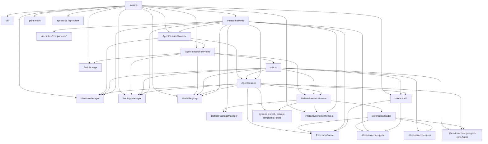
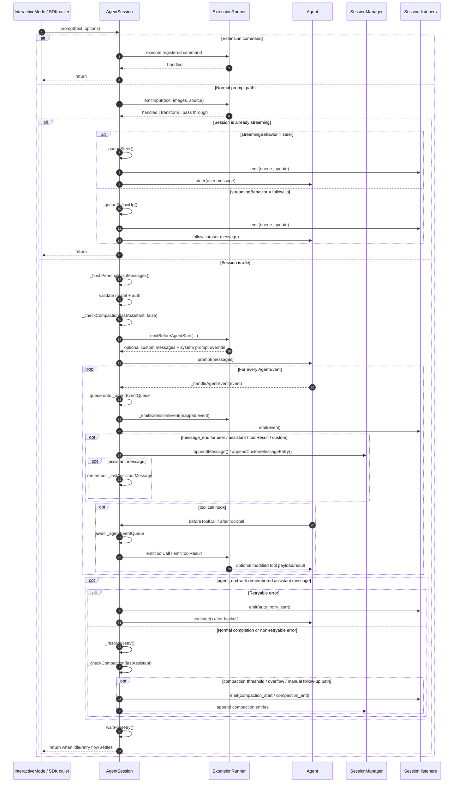
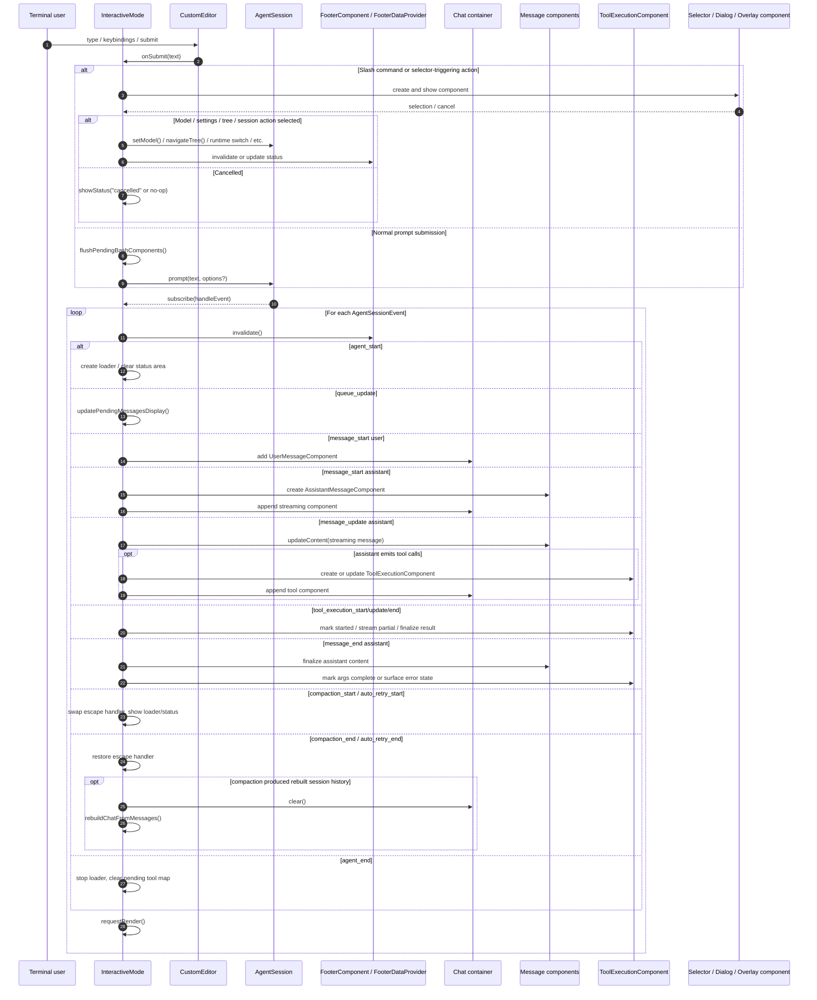
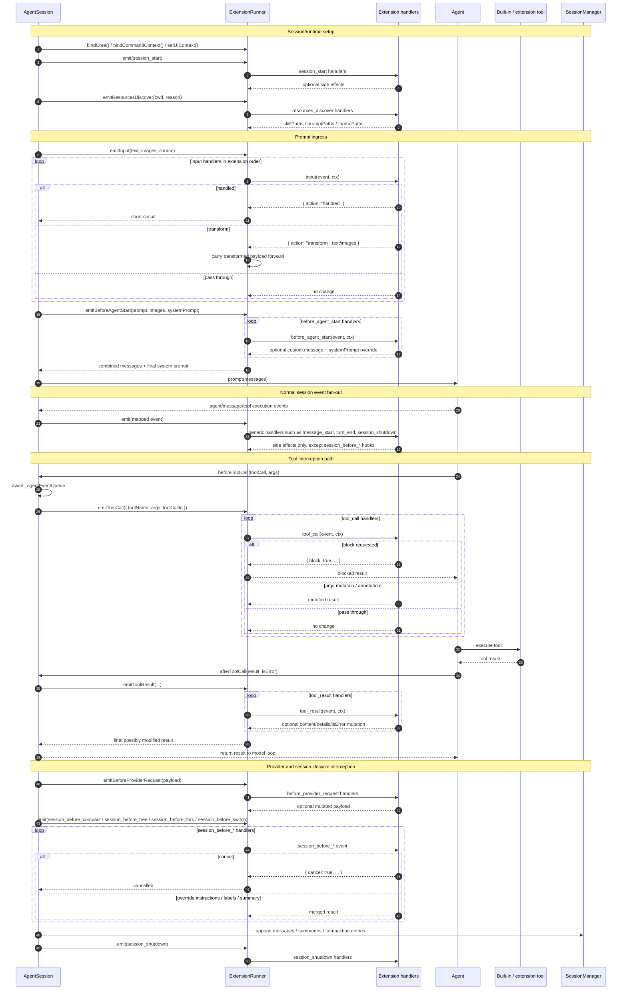

# pi-coding-agent Internal Dependency Overview

This document summarizes how the major components and classes inside `packages/coding-agent` depend on each other.

## High-Level Structure

At a high level, `pi-coding-agent` is organized like this:

- `main.ts` is the composition root. It parses CLI input, initializes shared services, and selects a run mode.
- `AgentSession` is the business center. It owns the active agent, session state, tools, prompts, compaction, and extension lifecycle binding.
- `InteractiveMode` is the main UI orchestrator. It renders TUI state and translates user input into session actions.
- `DefaultResourceLoader` and `ExtensionRunner` form the extension and customization center.
- `core/tools/*` provides built-in tools and their rendering behavior.

The most important practical point is:

- `main.ts` assembles
- `AgentSessionRuntime` swaps sessions
- `sdk.ts` builds sessions
- `AgentSession` runs the session
- `InteractiveMode` presents and controls it

## Dependency Graph

## Layer-by-Layer Analysis

## 1. Entry and Composition Layer

`src/main.ts` is not the business core. Its job is to wire the package together.

It directly coordinates:

- CLI parsing from `src/cli/*`
- startup state such as `AuthStorage`, `SettingsManager`, `SessionManager`, and `ModelRegistry`
- runtime creation via `createAgentSessionServices()`, `createAgentSession()`, and `createAgentSessionRuntime()`
- mode dispatch into:
  - `InteractiveMode`
  - `runPrintMode`
  - `runRpcMode`

So `main.ts` depends on many modules, but mostly as a composition root.

## 2. Core Business Center: `AgentSession`

`src/core/agent-session.ts` is the real center of the package.

It owns or coordinates:

- the underlying `Agent` from `@mariozechner/pi-agent-core`
- message and session state persistence through `SessionManager`
- model and thinking-level changes
- active tool registration
- prompt expansion and system prompt assembly
- queueing, branching, forking, compaction, and retry behavior
- extension hook integration through `ExtensionRunner`

This makes `AgentSession` the main orchestration object for an actual coding session.

Its important dependencies are:

- `SessionManager`
- `SettingsManager`
- `ModelRegistry`
- `ResourceLoader`
- `ExtensionRunner`
- `core/tools/index.ts`
- `core/compaction/*`
- `core/system-prompt.ts`

In other words:

- `Agent` handles model interaction
- `AgentSession` turns that into a full coding-agent session

## 3. Session Creation Chain

The creation flow is intentionally split across three layers.

### `agent-session-services.ts`

This layer creates cwd-bound infrastructure services:

- `AuthStorage`
- `SettingsManager`
- `ModelRegistry`
- `DefaultResourceLoader`

It is infrastructure assembly, not session execution.

### `sdk.ts`

This layer creates the actual `AgentSession`.

It is responsible for:

- creating the underlying `Agent`
- restoring existing session model and thinking level
- selecting initial models
- registering tools
- using loaded resources and settings during session construction

This is the session factory layer.

### `agent-session-runtime.ts`

This layer owns the currently active session and services.

It is responsible for:

- replacing the current session
- switching sessions
- creating new sessions
- forking sessions
- importing sessions
- tearing down the current runtime before applying the next one

This is a lifecycle host, mainly used by the UI and other run modes.

## 4. Resource and Extension Layer

This is the most distinctive subsystem in `pi-coding-agent`.

### `DefaultResourceLoader`

`src/core/resource-loader.ts` aggregates all user- or project-provided resources:

- extensions
- skills
- prompt templates
- themes
- `AGENTS.md` / `CLAUDE.md`
- system prompt additions

Its main dependencies are:

- `DefaultPackageManager`
- `extensions/loader.ts`
- `skills.ts`
- `prompt-templates.ts`
- `theme.ts`

It works as a unified resource discovery and loading hub.

### `extensions/loader.ts`

This module is responsible for:

- dynamically loading TypeScript extensions with `jiti`
- creating the extension API surface
- registering commands, tools, shortcuts, flags, providers, and message renderers
- handling Bun-binary-specific virtual module behavior

It loads and registers extensions, but does not drive their runtime lifecycle.

### `ExtensionRunner`

`src/core/extensions/runner.ts` is the execution-side coordinator for extensions.

It is responsible for:

- binding session actions into the extension runtime
- dispatching extension events
- handling hooks like:
  - `before_agent_start`
  - `before_provider_request`
  - tool call / tool result hooks
  - session lifecycle hooks
- exposing UI context and session context callbacks

The relationship is:

- `ResourceLoader` discovers and prepares resources
- `ExtensionLoader` turns extension files into runtime objects
- `ExtensionRunner` executes them during a real session

That forms a clean `discover -> load -> bind -> run` chain.

## 5. Tool Layer

`src/core/tools/index.ts` is the built-in tool registry.

It exports:

- `read`
- `bash`
- `edit`
- `write`
- `grep`
- `find`
- `ls`

It also provides:

- concrete `AgentTool` instances
- `ToolDefinition` instances
- factory functions scoped to a custom cwd

This part is mostly cohesive, but there is one architectural detail worth noticing:

- the tool layer is not purely backend logic

Some built-in tools depend on interactive rendering helpers:

- `read.ts` depends on interactive theme and keybinding hints
- `bash.ts` depends on interactive truncation and theme helpers
- `edit.ts` depends on diff/render-oriented UI helpers

So the tool layer mixes:

- execution behavior
- TUI rendering behavior

That means `core/tools/*` is not fully independent of `modes/interactive/*`.

## 6. UI Layer: `InteractiveMode`

`src/modes/interactive/interactive-mode.ts` is the main TUI orchestrator and the second heaviest class after `AgentSession`.

It depends on:

- `AgentSessionRuntime`
- `AgentSession`
- `SessionManager`
- `KeybindingsManager`
- `FooterDataProvider`
- `DefaultPackageManager`
- `ExtensionRunner` and extension UI context
- all interactive components
- `theme.ts`
- `@mariozechner/pi-tui`

Its responsibilities include:

- subscribing to session events
- rendering chat messages, streaming content, and tool execution
- handling editor state and keyboard interactions
- opening selectors, overlays, dialogs, and custom extension UI
- managing headers, footers, widgets, and status messages

Conceptually:

- `AgentSession` is the business session orchestrator
- `InteractiveMode` is the TUI orchestration layer

## 7. UI Components

The components under `src/modes/interactive/components/*` are mostly leaf-level UI pieces.

Examples include:

- `AssistantMessageComponent`
- `ToolExecutionComponent`
- `SessionSelectorComponent`
- `SettingsSelectorComponent`
- `ModelSelectorComponent`
- `TreeSelectorComponent`
- `FooterComponent`

Most of them depend on:

- `@mariozechner/pi-tui`
- `theme.ts`
- a small number of core types

The important structural point is:

- components are mostly coordinated by `InteractiveMode`
- there are relatively few deep cross-dependencies between the components themselves

That keeps the component layer flatter than the session layer.

## 8. Main Runtime Path

The main runtime path looks like this:

1. `main.ts`
2. `createAgentSessionServices()`
3. `createAgentSession()`
4. `new Agent(...)`
5. `new AgentSession(...)`
6. `new InteractiveMode(...)` or print/rpc mode
7. `InteractiveMode` subscribes to `AgentSessionEvent`
8. `ExtensionRunner` injects hooks into the session lifecycle
9. `core/tools/*` executes and renders built-in tool behavior

## 9. Practical Architectural Conclusions

If the codebase is evaluated by architectural weight, the most central modules are:

1. `AgentSession`
2. `InteractiveMode`
3. `DefaultResourceLoader`
4. `ExtensionRunner`
5. `SessionManager`
6. `sdk.ts`
7. `main.ts`

The strongest parts of the structure are:

- the separation between composition, services, runtime, and session creation
- the clear loader/runner split in the extension system
- the fact that the package works both as a CLI and as an embeddable SDK

The most important coupling points are:

- `AgentSession` is close to a god object
- `InteractiveMode` is the UI equivalent of a god object
- `core/tools/*` mixes execution and UI rendering concerns
- `theme.ts` acts as a cross-cutting dependency used from multiple layers

## Suggested Next Diagrams

If a deeper analysis is needed, the next three useful diagrams would be:

1. a detailed internal dependency graph for `AgentSession`
2. an interaction graph between `InteractiveMode` and all interactive components
3. an event and hook flow graph for `ExtensionRunner` and the built-in tools

## Detailed Diagram 1: `AgentSession` Event Sequence

The most important runtime behavior in `AgentSession` is not just "call `agent.prompt()`".
It is the orchestration around that call:

- preprocessing user input and extension commands
- serializing all `AgentEvent` handling through `_agentEventQueue`
- forwarding mapped events to `ExtensionRunner`
- persisting completed messages through `SessionManager`
- running retry and compaction logic only after `agent_end`

### Reading Notes

- `AgentSession` does not process `Agent` events inline. `_handleAgentEvent()` appends work onto `_agentEventQueue` so persistence and extension hooks stay ordered.
- `message_end` is the persistence boundary. That is where user, assistant, tool-result, and custom messages become durable session entries.
- Tool interception is intentionally downstream of prior event draining. `beforeToolCall` waits for `_agentEventQueue` so extension tool hooks see an up-to-date `SessionManager`.
- Retry and compaction are post-turn responsibilities. They run only after `agent_end`, using `_lastAssistantMessage` as the turn-final decision point.
- A queued `steer()` or `followUp()` message never goes through the full idle prompt path. It updates queue state and hands the message directly to the underlying `Agent`.

## Detailed Diagram 2: `InteractiveMode` and Component Interaction

`InteractiveMode` is not just a passive renderer.
It sits between terminal input, `AgentSessionRuntime`, `AgentSession`, and a wide set of focused UI components.
Its main job is to:

- translate key input and editor submission into session actions
- subscribe to `AgentSessionEvent` and project them into chat/status/footer UI
- open transient selectors, dialogs, overlays, and extension UI
- rebuild component state when session/runtime state changes

### Reading Notes

- `InteractiveMode` has one dominant inbound channel: `session.subscribe(async event => handleEvent(event))`. Most UI state changes are projections of `AgentSessionEvent`.
- The editor is only one source of actions. Selectors and dialogs also call back into `InteractiveMode`, which then invokes `AgentSession` or `AgentSessionRuntime`.
- Streaming assistant UI is optimistic and incremental. `message_start` creates a live `AssistantMessageComponent`, while `message_update` grows it and attaches tool components as tool calls appear.
- Tool UI state is keyed by `toolCallId` in `pendingTools`, which lets `InteractiveMode` correlate `message_update` tool calls with later `tool_execution_*` events.
- Compaction and retry temporarily rewire keyboard behavior, especially Escape handling, so the same UI can remain interactive while the underlying session is in a special state.

## Detailed Diagram 3: `ExtensionRunner`, Hooks, and Built-in Tools

The extension subsystem is not a single callback point.
It is a set of interception layers wrapped around session startup, prompt preprocessing,
provider requests, tool execution, and session lifecycle transitions.

The key architectural point is:

- `AgentSession` owns when hooks are called
- `ExtensionRunner` owns how handlers are resolved and sequenced
- extensions can either observe, mutate, block, or enrich the flow depending on hook type

### Reading Notes

- `ExtensionRunner.emit()` is the generic path for ordinary events. It mainly provides ordered side effects, with special merging behavior only for `session_before_*` events.
- `emitInput()` is a transform pipeline. Earlier extensions can rewrite text/images, and later extensions see the rewritten payload.
- `emitBeforeAgentStart()` is the last extension-controlled point before `AgentSession` calls `agent.prompt()`. It can inject custom messages and replace the effective system prompt for that turn.
- `emitToolCall()` and `emitToolResult()` are the two high-leverage interception points. They let extensions block a tool call, mutate tool-call metadata, or rewrite tool output before it returns to the model.
- `AgentSession` deliberately waits for `_agentEventQueue` before `tool_call` hooks. That keeps extension tool logic consistent with already-persisted assistant/tool state.
- `session_before_compact`, `session_before_tree`, `session_before_fork`, and `session_before_switch` are not just notifications. They are decision points where extensions can cancel or override the pending session operation.

## Combined Architectural Reading

Taken together, the three diagrams show that `packages/coding-agent` is organized around a fairly clear runtime spine:

1. `InteractiveMode` captures terminal intent and renders state
2. `AgentSession` owns session semantics and turn orchestration
3. `ExtensionRunner` injects programmable interception points around that orchestration
4. `Agent` executes the actual model/tool loop
5. `SessionManager` persists the durable session timeline

That means the package is not centered on the TUI and it is not centered purely on the model loop either.
It is centered on `AgentSession` as the semantic boundary between:

- user intent
- model execution
- extension participation
- durable session history

### What Is Clean About The Design

The strongest design property is that event handling and persistence are centralized.
`AgentSession` is the place where:

- `AgentEvent` becomes `AgentSessionEvent`
- extension lifecycle hooks are triggered
- retry and compaction decisions are made
- queue state is synchronized with actual message flow
- session history becomes durable

That centralization is valuable because it creates one place where ordering guarantees can be enforced.
The `_agentEventQueue` is especially important here. It prevents extension hooks, session persistence, and UI listeners from racing each other across asynchronous boundaries.

The second strong property is that `InteractiveMode` is mostly a projection layer.
It is large, but most of its complexity comes from rendering and interaction management rather than owning the underlying session rules.
That is a healthier split than embedding prompt logic, retry logic, or session persistence directly into the UI layer.

The third strong property is that the extension system has clear hook classes:

- preprocessing hooks like `input` and `before_agent_start`
- observational lifecycle hooks like `message_start`, `turn_end`, `session_shutdown`
- decision hooks like `session_before_compact` and `session_before_tree`
- mutation hooks like `tool_call`, `tool_result`, and `before_provider_request`

Those are meaningfully different responsibilities, and the code mostly preserves that distinction.

### Where The Coupling Still Bites

The diagrams also make clear why `AgentSession` still feels close to a god object.
It owns too many orchestration concerns at once:

- prompt ingress
- queue management
- event serialization
- tool hook bridging
- retry policy
- compaction policy
- branch/tree navigation
- bash execution recording
- extension binding
- session export/import-adjacent behavior

None of these are random responsibilities, but together they make `AgentSession` the convergence point for nearly every important runtime concern.

`InteractiveMode` has a similar but UI-shaped problem.
It owns:

- event rendering
- editor submission behavior
- selector/dialog orchestration
- transient status state
- streaming message assembly
- pending tool component correlation
- retry/compaction-specific input mode switching

That is not accidental complexity. It follows naturally from being the main TUI orchestrator.
But it does mean that understanding or changing one interaction often requires touching a large class with many concurrent responsibilities.

The tool layer also remains only partially separated.
At the architecture level, tools look like backend capabilities.
In practice, parts of tool behavior still lean on interactive rendering assumptions, which weakens the conceptual boundary between:

- session/tool execution
- TUI presentation

### Practical Refactoring Directions

If this area were to be refactored further, the diagrams suggest a few high-value directions.

1. Split `AgentSession` by orchestration domain, not by arbitrary file size.
   Candidate internal services would be:
   - turn ingress and queueing
   - event pipeline and persistence
   - retry/compaction coordinator
   - tree/fork/navigation coordinator
   - extension bridge

2. Extract an event projection layer out of `InteractiveMode`.
   Right now `handleEvent()` is both:
   - an event interpreter
   - a component mutation coordinator

   A separate projection object could map `AgentSessionEvent` into a smaller UI state model, leaving `InteractiveMode` to focus more on widget orchestration.

3. Clarify tool execution versus tool presentation boundaries.
   The current architecture would be easier to reason about if tool execution produced a neutral result model and the TUI owned all rendering-specific decoration separately.

4. Preserve the current ordering guarantees as a non-negotiable invariant.
   Any future refactor must keep the semantic guarantee currently provided by `_agentEventQueue`, because a large amount of correctness depends on it:
   - extension hooks seeing coherent state
   - `SessionManager` persistence order
   - UI consistency for streaming/tool events

### Bottom Line

The package has a real architecture, not just a pile of features.
Its center of gravity is `AgentSession`, with `InteractiveMode` as the main projection/controller layer and `ExtensionRunner` as the programmable interception layer.

The main architectural risk is not confusion about control flow.
The control flow is actually fairly structured.
The main risk is concentration: too much runtime meaning is concentrated into a few large classes.

That is why the next valuable step after these diagrams would not be more diagrams first.
It would be a responsibility map for `AgentSession` and `InteractiveMode`, listing which methods belong to which conceptual subsystem and which ones should move together if the code is split.
