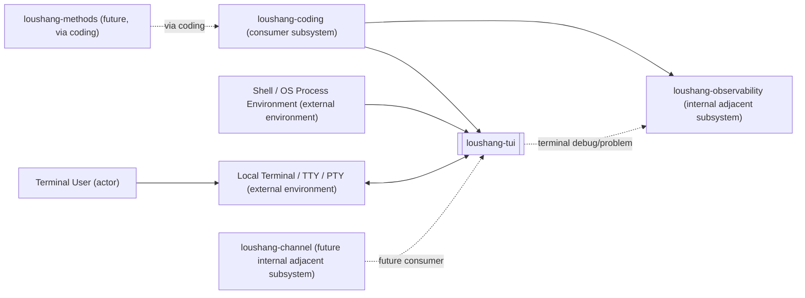
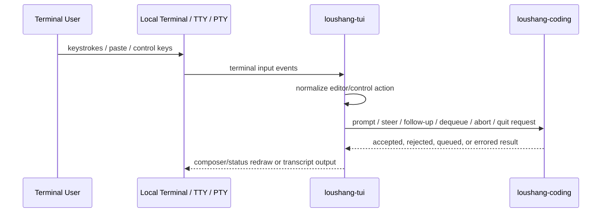
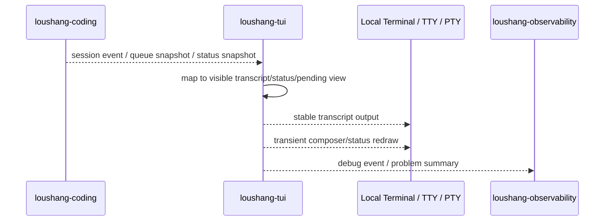
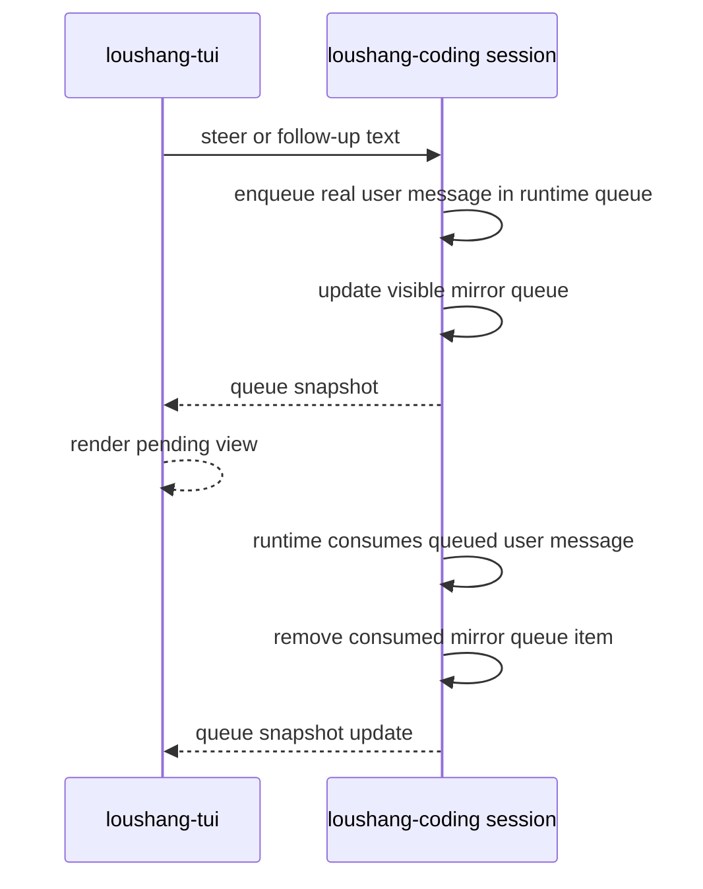
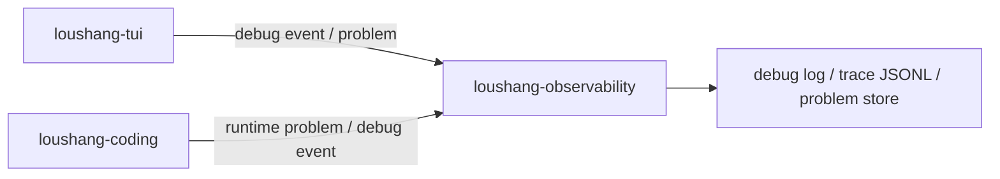

# Loushang TUI System Context

## Scope

本文档将 `loushang-tui` 视为一个黑盒终端 UI 子系统，描述它的外部 actor、相邻子系统、依赖方向与信息流关系。

这里的 `loushang-tui` 指 `loushang.tui` 所代表的通用 terminal UI 能力边界，而不是 `loushang-coding` 的完整 interactive product assembly。

本文档的目标是先钉住 `loushang-tui` 的系统边界，为后续：

- 白盒候选组件识别
- `loushang.tui` 通用终端基础层拆分
- `loushang.coding.ui` 如何消费 `loushang.tui`
- TUI lifecycle / queue / abort / debug 行为收敛

提供稳定输入。

本文不展开：

- `prompt_toolkit` / Rich 的内部 API 使用方式
- 具体 key binding 绑定表
- `AgentSession` 内部状态机
- tool execution policy
- channel 协议设计
- extensions UI 设计

## Why This Exists

当前 `loushang-tui` 已经从早期 Textual / full-screen 方案收敛到 terminal-native inline 方案：

- 保留真实 terminal scrollback 作为可回看的 transcript
- 使用底部 composer / status 作为临时 UI
- 被 `loushang.coding.ui` 消费，用于连接 coding session
- 运行中支持 steer / follow-up / queued message 展示
- abort、debug、provider/tool error 需要保持可恢复与可诊断

如果不先明确 system context，后续很容易把几类变化混在一起：

- 终端输入输出变化
- coding runtime consumer 语义变化
- session queue truth 变化
- observability/debug 变化
- 第三方终端 UI 库的实现细节变化

因此，`loushang-tui` 的 system context 首先回答：

- 谁直接使用 `loushang-tui`
- `loushang-tui` 直接和哪些系统交互
- 哪些信息跨过 `loushang-tui` 黑盒边界
- 哪些技术只是内部实现载体，不应成为系统环境图里的外部组件

## External Entities

### Actors

- `Terminal User`
  - 在本地终端中启动和使用 `loushang-tui`
  - 输入 prompt、多行文本、快捷键、粘贴内容
  - 查看 transcript、tool summary、error、debug 提示与 status

### External Systems / Physical Environment

- `Local Terminal / TTY / PTY`
  - `loushang-tui` 的直接物理运行环境
  - 提供 stdin / stdout / stderr、真实 scrollback、ANSI/VT 控制序列、terminal size、paste、resize、Ctrl-C 等信号
  - PTY 同时是自动化验证环境，用于复现真实终端交互时序

- `Shell / OS Process Environment`
  - 提供 cwd、environment variables、process lifecycle、console script execution
  - 不等同于 coding tool shell；这里描述的是 `loushang-tui` 进程自己的宿主环境

### Implementation Technologies

以下对象不是 system context 里的外部系统或相邻子系统。它们只是 `loushang-tui` 内部采用的第三方开源实现技术：

- `prompt_toolkit`
  - 用于 inline terminal application、composer、key binding、bottom status、stdout coordination

- `Rich`
  - 可用于终端富文本渲染、颜色、样式与人类可读输出

这些技术可以在 physical / implementation 文档中展开，但不应与 `loushang-coding`、`loushang-agent` 等 Loushang 子系统平级出现在系统环境图中。

## Internal Adjacent Subsystems

### loushang-coding

`loushang-coding` 是 `loushang-tui` 当前最重要的直接 consumer 子系统。

在源码层面，`loushang.coding.ui` 依赖 `loushang.tui`，并把 coding session/runtime 状态投影到 terminal UI primitives 上。

`loushang-coding` 通过 `loushang-tui` 呈现：

- coding runtime / session lifecycle
- prompt / steer / follow-up / abort / bash intent
- model selection / thinking / cwd / session metadata
- tool execution lifecycle events
- retry / compaction / diagnostics / session store

`loushang-tui` 不反向持有这些 truth；它只承接 `loushang-coding` 提供的可展示状态、控制动作与渲染请求。

### loushang-observability

`loushang-observability` 是 `loushang-tui` 的横切支撑相邻子系统。

它承接：

- TUI debug event
- problem report
- per-session debug log
- trace JSONL
- diagnostics bundle/export 的输入材料

`observability` 记录 TUI/runtime 事实，但不应反向驱动 TUI 行为。

### loushang-channel (future)

`loushang-channel` 是未来可能接入的边界协议子系统。

未来可能承接：

- remote attach
- UI capability negotiation
- replay / audit
- multi-client event projection

当前 `loushang-tui` 不以 `channel` 落地作为前置条件。

### loushang-methods (future)

`loushang-methods` 是未来可能通过 `loushang-coding` 暴露到 TUI 的方法资产子系统。

`loushang-tui` 不直接解释 method guidance。未来如果出现 method selection / workflow UI，也应由 `loushang-coding` 提供可展示状态与操作接口，TUI 只负责交互呈现。

### Non-boundary systems: loushang-agent and loushang-ai

`loushang-agent` 与 `loushang-ai` 不属于 `loushang-tui` 的直接 system context 边界。

`loushang-tui` 与 `loushang-ai` 没有直接交互。模型/provider 相关信息必须由 `loushang-coding` 作为 session/status snapshot 投影给 TUI。

`loushang-tui` 与 `loushang-agent` 也没有直接交互。agent 运行事实必须先被 `loushang-coding` 归一化，再投影给 TUI。

因此，`loushang-agent` 与 `loushang-ai` 不应出现在 `loushang-tui` 的直接依赖图中。

## Dependency Relations

本节只描述依赖方向，不描述运行时信息是否真的流过该边界。



关键约束：

- `Terminal User` 与 `Local Terminal / TTY / PTY` 是 `loushang-tui` 的直接外部边界。
- `loushang-coding` 依赖 `loushang-tui` 获得 terminal UI primitives。
- `loushang-tui` 不依赖 `loushang-coding`、`loushang-agent` 或 `loushang-ai`。
- `loushang-coding` 可向 `loushang-observability` 写入 coding UI/debug/problem 事实。
- `loushang-tui` 可向 `loushang-observability` 写入 terminal UI/debug/problem 事实。
- `prompt_toolkit` / Rich 不在图中出现，因为它们是内部实现技术，不是系统边界。

## Implementation Mapping

系统层面的 `loushang-tui` 终端 UI 子系统在源码中主要映射为：

```text
src/loushang/tui/
  generic terminal UI primitives
  inline prompt application
  composer/status/output/keybinding/terminal helpers
```

直接 consumer 主要映射为：

```text
src/loushang/coding/ui/
  coding product adapter
  intent parsing
  session event subscription
  transcript renderer mapping
  model/status/debug/abort integration
```

依赖方向必须保持：

```text
loushang.tui
  does not depend on loushang.coding

loushang.coding core
  does not depend on loushang.tui

loushang.coding.ui
  depends on loushang.tui
  depends on loushang.coding
```

因此，如果把 `loushang.coding.ui` 计入 `loushang-coding` 产品包，源码依赖方向是：

```text
loushang-coding -> loushang-tui
```

`loushang.coding.ui` 是源码层面连接 coding runtime 与通用 TUI primitives 的适配层。

## Information Flow Relations

本节描述跨边界的数据/回调流，不改变前一节的源码依赖方向。源码依赖方向仍是 `loushang-coding -> loushang-tui`。

### User Input Flow



跨边界输入包括：

- prompt text
- multi-line composer content
- submit / newline / abort / quit control action
- steer request
- follow-up request
- dequeue queued messages request
- debug enable/disable command

`loushang-tui` 负责终端输入归一化。
`loushang-coding` 负责解释这些输入在 coding runtime 中的业务语义。

### Runtime Event Flow



跨边界输出包括：

- user prompt echo point
- assistant final block
- tool execution summary
- error/interruption block
- worked divider
- queue snapshot for pending messages
- model/cwd/session/status snapshot
- debug/problem facts

`loushang-coding` owns runtime truth。
`loushang-tui` owns only transient terminal presentation。

### Queue State Flow

运行中输入的 queue truth 位于 `loushang-coding` / session 层。



关键约束：

- TUI 不维护 canonical queue。
- TUI 只展示 session 暴露的 queue snapshot。
- dequeue 是请求 session 清空并返回 queued text，再由 TUI 放回 composer。

### Observability Flow



TUI 可记录：

- input routing
- queue display/dequeue lifecycle
- abort lifecycle
- transcript emit lifecycle
- render/terminal errors

这些记录用于诊断，不改变 TUI 与 coding runtime 的业务语义。

## Functional Boundary

### loushang-tui owns

- terminal input normalization
- composer/editor transient state
- key/control action recognition
- transient status line / working line / pending view
- terminal output coordination
- terminal/PTY capability handling
- human-facing display of accepted coding state

### loushang-tui does not own

- coding session truth
- agent loop truth
- model/provider truth
- tool execution truth
- transcript persistence truth
- canonical queue truth
- compaction/retry policy
- extension runtime truth

### loushang-coding owns

- prompt / steer / follow-up / abort semantics
- runtime/session lifecycle
- queue truth and visible mirror queue
- tool registry and execution
- model selection and auth bridge
- diagnostics / compaction / retry
- session store / replay / export

### loushang-observability owns

- debug log sinks
- trace sinks
- problem records
- diagnostic export material

## Physical System Context

`loushang-tui` 的关键物理约束来自 terminal，而不是来自某个 UI framework：

- terminal scrollback 是用户可见 transcript 的物理载体
- composer/status/working/pending view 是临时绘制区域
- P0 使用 inline terminal application，不使用 alternate-screen full-screen UI
- PTY 是自动化验证真实交互时序的物理替身
- terminal escape sequence 差异会影响 `Alt+Enter`、`Alt+Up` 等快捷键可靠性

这意味着实现技术选择必须服务于 terminal-native 产品形态：

- `prompt_toolkit` 可作为当前 inline composer / keybinding / redraw 技术
- `Rich` 可作为当前或后续 formatted output 技术
- 但二者都不是 system context 中的外部系统边界

## System Context Derived Variation Sources

从系统环境图看，后续组件识别应重点吸收这些变化源：

1. `Local Terminal / TTY / PTY`
   - terminal size、escape sequence、paste、Ctrl-C、stdout coordination

2. `Terminal User`
   - prompt editing、multi-line composer、running-time steering、abort、debug workflow

3. `loushang-coding`
   - session lifecycle、queue snapshot、tool events、model/status metadata、errors

4. `loushang-observability`
   - debug scopes、trace sinks、problem records、diagnostics export

5. Future `loushang-channel`
   - remote attach、event projection、capability negotiation

这些变化源提示的候选组件包括：

- inline runtime
- composer/editor state
- keybinding/action router
- pending queue view
- transcript emitter
- status provider
- coding UI adapter
- terminal/PTY test harness
- observability bridge

这些是白盒组件识别的输入，不是本文需要最终定稿的组件结构。

## Key Constraints

1. `loushang-tui` must preserve real terminal scrollback.
2. `loushang.tui` must remain coding-agnostic.
3. `loushang.coding` must remain UI-agnostic.
4. `loushang.coding.ui` is the source-level adapter between terminal UI primitives and coding runtime.
5. TUI must not own canonical queue/session/tool/model truth.
6. TUI may render queue/status snapshots from session, but must not infer runtime truth from local UI state.
7. Observability records facts and failures; it must not drive normal UI control flow.
8. Third-party UI libraries are implementation technologies, not external system context nodes.

## Next Documents

本 system context 之后，建议继续补充：

1. `loushang-tui` whitebox candidate components
2. `loushang.tui` component responsibilities
3. `loushang.coding.ui` adapter responsibilities
4. TUI keybinding/action contract
5. PTY scenario verification plan
