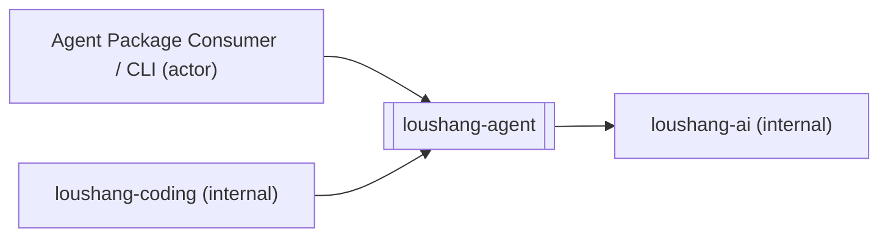

# Loushang Agent System Context

## Scope

本文档将 `loushang-agent` 视为一个黑盒子系统，描述它的外部子系统、依赖关系与信息流关系。

本文档目标是先确定 `loushang-agent` 的系统边界，为后续从 `reference agent runtime` 迁移到 `loushang-agent` 的白盒分析与组件识别提供落点。

本文不展开：

- `loushang-agent` 内部类型系统细节
- `Agent` / `AgentLoop` 的白盒组件分解
- 具体 session persistence / compaction / summary 的最终实现归属
- `coding`、`channel`、`tui` 的内部实现细节

这些内容将在后续文档中继续展开。

## Why This Exists

在当前收敛后的子系统依赖中，`loushang-agent` 的主链路已经明确为：

```text
loushang-tui -> loushang-channel -> loushang-coding -> loushang-agent -> loushang-ai
```

这意味着：

- `loushang-agent` 不直接面向 `tui`
- `loushang-agent` 也不直接面向 `channel`
- `loushang-agent` 的直接上游装配子系统是 `loushang-coding`
- `loushang-agent` 的直接下游能力子系统是 `loushang-ai`

因此，本轮系统环境图不应再把 `loushang-channel` 或 `loushang-tui` 画成 `loushang-agent` 的直接外部边界，而应聚焦于：

- 谁直接装配和驱动 `loushang-agent`
- `loushang-agent` 依赖谁提供模型能力
- 哪些信息、功能、数据与协议真正跨过 `loushang-agent` 黑盒边界

## External Entities

`loushang-agent` 的直接外部对象建议只保留以下两类内部相邻子系统。

### External Systems

- `loushang-ai`
  - `loushang-agent` 的直接下游能力子系统
  - 为 `loushang-agent` 提供模型、provider、streaming 与相关 AI 调用能力

- `loushang-coding`
  - `loushang-agent` 的直接上游装配子系统
  - 负责 coding 场景下的 prompt、tooling、methods、display control 与运行策略装配

### Actors

- `Agent Package Consumer / CLI`
  - 泛化的直接调用主体
  - 代表谁在逻辑上直接消费 `loushang-agent` 的 public runtime API
  - 这类 actor 可以是测试、example、CLI runner 或未来其他直接调用者

## Internal Adjacent Subsystems

### loushang-coding

`loushang-coding` 是 `loushang-agent` 的直接上游子系统。

它不只是简单调用者，而是面向 coding 场景的装配层。  
它向 `loushang-agent` 提供的不是 provider 协议，而是：

- 场景策略
- toolset 装配
- methods/skills 注入
- memory policy
- display control policy
- 与 channel / tui 的产品化集成

因此，`loushang-agent` 在系统环境图中应直接把 `loushang-coding` 识别为最关键的内部 consumer subsystem。

### loushang-ai

`loushang-ai` 是 `loushang-agent` 的直接下游子系统。

它承接：

- 模型抽象
- provider 接入
- 流式输出
- auth / transport / model family 等变化吸收

`loushang-agent` 不负责这些变化面，因此必须依赖 `loushang-ai`。

## Dependency Relations

本节只描述依赖关系，不描述运行时信息是否真的流过该边界。



### loushang-coding -> loushang-agent

这是当前 `loushang-agent` 最重要的直接上游依赖关系。

依据 [subsystem.md](/home/dev/workspace/loushang/docs/architecture/subsystem.md#L120) 与 [subsystem-diagram.md](/home/dev/workspace/loushang/docs/architecture/subsystem-diagram.md#L1)：

- `loushang-coding` 负责 coding 场景装配
- `loushang-agent` 负责通用 agent runtime

因此，`coding` 必然依赖 `agent`，而不是反过来。

### loushang-agent -> loushang-ai

这是 `loushang-agent` 最重要的直接下游依赖关系。

依据 [subsystem.md](/home/dev/workspace/loushang/docs/architecture/subsystem.md#L42)：

- `loushang-agent` 不负责 provider 接入细节
- `loushang-ai` 负责统一 AI 调用与 provider 适配

因此，`agent` 必然依赖 `ai`。

### Agent Package Consumer / CLI -> loushang-agent

这是一个逻辑 actor，不等同于单一内部子系统。

它代表所有直接以 package / runtime API 方式消费 `loushang-agent` 的主体，例如：

- test caller
- example caller
- future direct CLI runner
- 其他不经过 `loushang-coding` 的 runtime consumer

保留这个 actor 的价值在于说明：

- `loushang-agent` 不是只能被 `coding` 使用
- 它仍然存在独立 public runtime surface

## Information Flow Relations

本节只描述 `loushang-agent` 黑盒边界上的信息输入与信息输出。

### loushang-coding <-> loushang-agent

`loushang-coding` 向 `loushang-agent` 输入的信息包括：

- system prompt / instruction augmentation
- tool definitions / tool enablement
- memory policy 相关控制信息
- methods / skills / workflow guidance
- user input 在 coding 场景下的组织结果
- coding-specific custom messages 或运行控制命令

`loushang-agent` 向 `loushang-coding` 输出的信息包括：

- assistant message
- tool call / tool result
- turn / message / tool execution lifecycle events
- runtime state changes
- error / interrupted / aborted 语义

这里的关键点是：

- `coding` 决定“如何装配和控制运行”
- `agent` 决定“运行时如何推进和产出标准语义”

### loushang-agent <-> loushang-ai

`loushang-agent` 向 `loushang-ai` 输入的信息包括：

- system prompt
- 当前 turn 可见的消息上下文
- model 选择
- thinking level / runtime inference options
- tool schema
- auth resolver / session id / stream options 等运行参数

`loushang-ai` 向 `loushang-agent` 输出的信息包括：

- assistant message stream
- final assistant message
- stop reason
- usage / token / cost metadata
- tool call blocks
- error / aborted 语义

这里的关键点是：

- `agent` 维护的是应用级 runtime context
- `ai` 消费的是面向模型调用的 projected context

## Functional Boundary

### loushang-agent

`loushang-agent` 应承载：

- 通用 `Agent` runtime
- loop / turn / message / tool orchestration
- 内存态 transcript
- runtime state
- event 语义
- interrupt / steering / follow-up 等运行控制

### loushang-coding

`loushang-coding` 应承载：

- coding-specific prompt / tool / policy 装配
- methods / skills 使用策略
- display control policy
- memory strategy
- compaction / summary / workflow 等场景决策

### loushang-ai

`loushang-ai` 应承载：

- model / provider / streaming abstraction
- provider family、auth、transport、model family 等变化吸收
- 通用 AI 调用能力

## Data Boundary

在黑盒边界上，建议明确区分两层数据模型。

### loushang-agent 的主数据

- `AgentMessage`
- `AgentState`
- `AgentContext`
- `AgentEvent`
- `AgentTool`

### loushang-ai 的主数据

- `Message`
- `AssistantMessage`
- `AssistantMessageEvent`
- `Context`
- `Model`

这意味着：

- `loushang-agent` 持有更宽的应用级 runtime transcript
- `loushang-ai` 只需要消费模型级消息与返回模型级流式事件

### loushang-coding 与 loushang-agent 的数据边界

`coding` 应在 `agent` 之上附加：

- coding-specific custom messages
- summary / compaction artifacts
- methods / skills 相关结构化数据
- coding workflow 状态

但这些数据不应反向污染 `loushang-agent` 的核心黑盒边界定义。

## Physical Protocol Boundary

### loushang-coding <-> loushang-agent

它们之间的物理协议应是进程内 API / 类型协议，而不是外部网络协议。

例如：

- 构造 `Agent`
- 调用 `prompt()` / `continue()`
- 注入 toolset / hooks / transformContext / convertToLlm
- 订阅 runtime events

### loushang-agent <-> loushang-ai

它们之间的物理协议同样应是进程内 API / stream abstraction。

而：

- SSE
- websocket
- provider SDK stream
- HTTPS request/response

这些都应被 `loushang-ai` 吸收，不应穿透为 `loushang-agent` 的主边界协议。

## Conclusion

在当前收敛后的系统关系下，`loushang-agent` 的黑盒系统环境图应只保留两个直接外部子系统：

- `loushang-coding`
- `loushang-ai`

其中：

- `loushang-coding` 是直接上游装配子系统
- `loushang-ai` 是直接下游能力子系统

而 `loushang-channel` 与 `loushang-tui` 不再属于 `loushang-agent` 的直接环境图主体，因为它们已被归入 `coding` 侧的产品化交互链路中。
