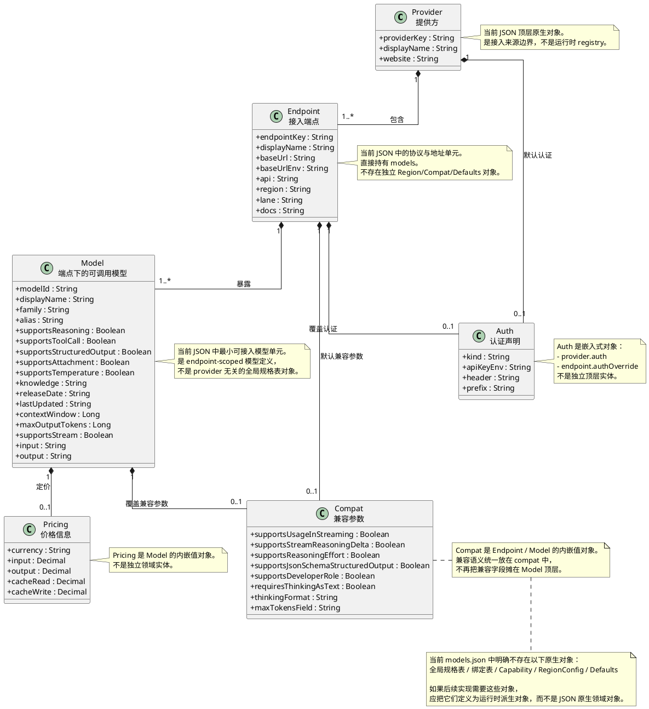

## `models.json` 领域模型 UML

说明：

- 本图表达的是 `models.json` 的领域来源。
- 运行时代码中的对象命名已经收敛为 `Model`，不再单独使用 `EndpointModel` 作为主命名。

本文 UML 只表达当前 `src/loushang/ai/model/models.json` 中原生存在的对象与关系。

约束：

- 不参考 `reference repository`
- 不参考 `kilocode`
- 不读取离线备份目录 `backup/ai/`
- 不把运行时抽象误写成 JSON 原生对象

