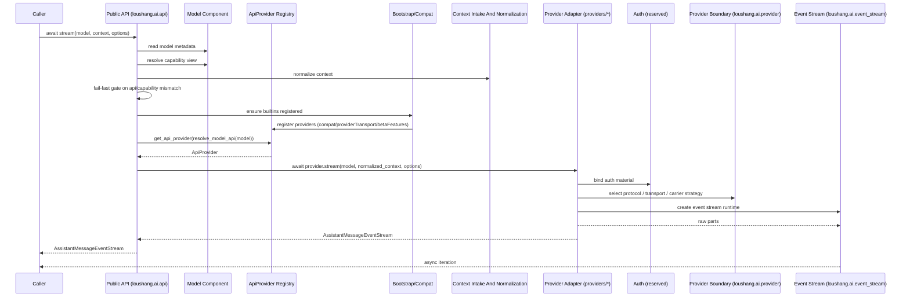
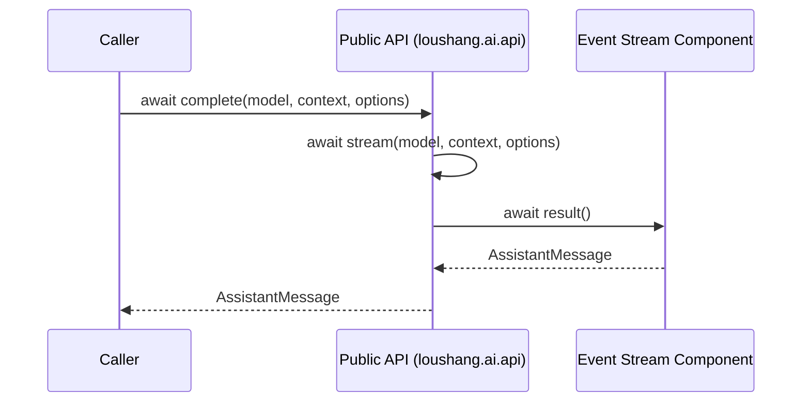
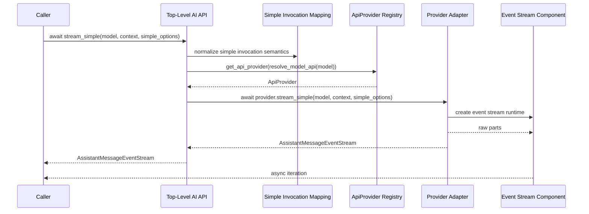
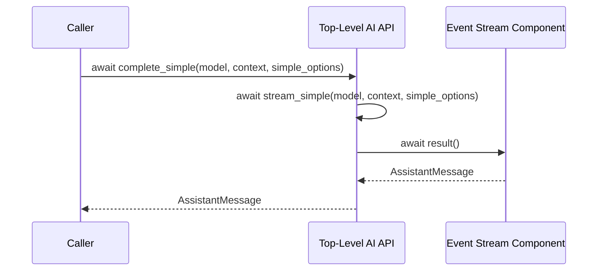
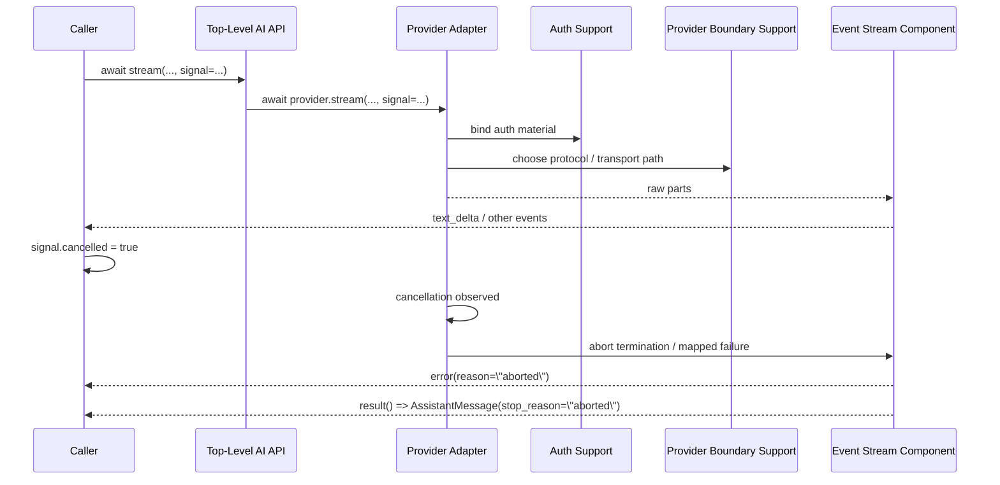
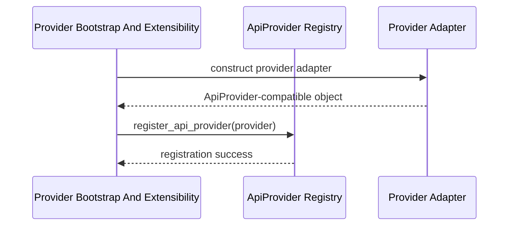

# Loushang-AI Component Interactions V1

> Status: pre-freeze design snapshot. This file predates AIF-009 and may mention removed simple entrypoints, compat, transport, or legacy option names. Current root invocation is `stream()` / `complete()` with `CallOptions`; use this document only as historical interaction input until AIF-015 archives or rewrites it.

## Scope

本文档描述 `loushang-ai` 第一版组件交互关系与关键时序。

本文档只讨论：

- 核心组件之间的主要协作链路
- `stream` / `complete` / `stream_simple` / `complete_simple` 的主时序
- cancellation / `aborted` 的主时序
- provider bootstrap / registry 接线时序

本文档不讨论：

- 具体字段级 payload
- provider 私有协议细节
- tool orchestration runtime
- 最终代码类图

---

## Input Documents

- [Loushang-AI Component Structure V1](./loushang-ai-component-structure-v1.md)
- [Loushang-AI Component Interfaces V1](./loushang-ai-component-interfaces-v1.md)
- [Loushang-AI Streaming and Cancellation](./loushang-ai-streaming-and-cancellation.md)
- [Loushang-AI Streaming Semantics](./loushang-ai-streaming-semantics.md)
- [Loushang-AI Record & Replay](./loushang-ai-stream-record-replay.md)

---

## Interaction Goals

当前组件交互设计优先保证：

1. `Public API (loushang.ai.api)` 是统一入口，而不是业务逻辑大桶
2. `Provider Adapter (loushang.ai.providers.*)` 是唯一直接理解具体 provider / protocol family 的边界执行单元
3. `Event Stream Component (loushang.ai.event_stream)` 是统一收敛主链路
4. cancellation 最终对外收敛为 `aborted`，而不是 runtime-specific 异常泄漏
5. model family 约束先由 `Model Component` 解释，protocol/auth/transport 变化再在边界支撑链路中被吸收，而不泄漏到 public event 主协议

---

## Main Interaction Paths

当前先冻结 6 条主交互路径：

1. `stream(...)`
2. `complete(...)`
3. `stream_simple(...)`
4. `complete_simple(...)`
5. abort / `aborted`
6. provider bootstrap / registry wiring

---

## 1. `stream(...)` Main Sequence

### Description

`stream(...)` 是最核心的主路径。  
它负责把一次统一 AI 调用接到正确的 provider，并在 async start 完成后返回统一 `AssistantMessageEventStream`。

### Sequence

### Notes

- `Public API` 不直接处理 provider payload
- `Public API` 必须先读取 `Model Component` 给出的 capability view，并在 provider lookup 前执行 fail-fast gate
- `Public API` 不直接拥有 family-specific 执行细节
- `Provider Adapter` 不直接生成 public event
- `Event Stream Component` 是 raw -> event / final message 的唯一中心
- `AssistantMessageEventStream` 作为 `Event Stream Component` 的对外读侧边界，只暴露只读消费能力
- async start responsibility 发生在 `Top-Level AI API -> Provider Adapter` 边界
- auth / protocol / transport 选择责任发生在 `Provider Adapter -> Auth Support / Provider Boundary Support` 边界之内，而不是 top-level API 之内

---

## 2. `complete(...)` Main Sequence

### Description

`complete(...)` 不应另起一条独立 provider 调用链。  
它建立在 `await stream(...); await result()` 之上。

### Sequence

### Notes

- `complete(...)` 与 `stream(...)` 共享同一收敛路径
- 不建议再维护另一套 provider-completion path
- `result()` 的调用责任在 `Public API` 内部，而不在调用方
- 这样才能保证 mixed consumption、abort、usage、stop reason 语义一致

---

## 3. `stream_simple(...)` Main Sequence

### Description

`stream_simple(...)` 是统一简化入口。  
它与 `stream(...)` 的主差别不在协作链路，而在 `SimpleStreamOptions` 的解释与映射。

### Sequence

### Notes

- `Simple Invocation Mapping` 是 shared supporting domain
- simple 入口的差异主要发生在 options 解释和 reasoning/thinking 映射上
- 一旦进入 raw-part 链路，后续收敛路径应与 full 入口尽量一致

---

## 4. `complete_simple(...)` Main Sequence

### Description

`complete_simple(...)` 和 `complete(...)` 一样，应建立在 `await stream_simple(...); await result()` 语义上。

### Sequence

### Notes

- `complete_simple(...)` 不应成为另一条 provider-specific shortcut
- `result()` 的调用责任在 `Top-Level AI API` 内部，而不在调用方
- 它应复用 simple stream path 的完整运行语义

---

## 5. Abort / `aborted` Main Sequence

### Description

cancellation 是关键时序之一。  
当前建议：内部可以使用 runtime cancellation 机制，但对外必须收敛为协议语义上的 `aborted`。

### Sequence

### Notes

- 取消检查可发生在调用前、流式循环中、收敛前
- `CancelledError` 这类 runtime 机制可以存在于内部
- 但最终对外语义应统一为：
  - `error(reason="aborted")`
  - `AssistantMessage.stop_reason = "aborted"`

---

## 6. Provider Bootstrap / Registry Wiring Sequence

### Description

这一条不是调用时序，而是组件接线时序。  
它确保 `Top-Level AI API` 在运行时能通过 `resolve_model_api(model)` 找到正确的 provider。

### Sequence

### Notes

- bootstrap 是 supporting domain，不是主业务调用路径
- 它不应替代 registry，也不应把 registry 逻辑吞掉
- faux/test provider 也应通过同一接线路径进入 registry
- provider bootstrap 负责接线，不负责吸收 model family / auth / transport 变化

---

## Interaction Ownership

从交互视角看，当前主拥有者应保持如下分工：

- `Top-Level AI API`
  - 拥有入口级时序
- `ApiProvider Registry`
  - 拥有 resolution 时序
- `Model Component`
  - 拥有 model family / capability handling 解释时序
- `Provider Adapter`
  - 拥有 provider-boundary execution 时序
- `Provider Boundary Support`
  - 拥有 protocol / transport / carrier 变化吸收时序
- `Event Stream Component`
  - 拥有收敛、对外流式消费与最终结果时序

如果后续某条时序的主拥有者变得模糊，说明边界开始回退。

---

## Cross-Cutting Interaction Notes

### Error Mapping

- 错误优先在 `Provider Adapter` 与 `Provider Boundary Support` 边界上归一
- registry resolution error 在 `ApiProvider Registry` 归一
- 对外最终暴露通过 `Event Stream Component` 与 `AssistantMessage`

### Tool Semantic Support

- tool schema 主要从 `Context Intake And Normalization` 进入
- tool-call 语义在 `Provider Adapter -> Event Stream Component` 路径里收敛
- `Tool Semantic Component` 为这条路径提供共享语义支持

### Observability

- 不单独改变主时序
- 主要挂在：
  - top-level entry
  - provider adapter boundary
  - event stream completion / failure

### Auth / Transport / Model Family

- `Model Component` 负责在 provider 调用前给出 family-aware handling 视图
- `Auth Support` 负责在 provider boundary 绑定认证材料
- `Provider Boundary Support` 负责在 provider boundary 选择 protocol / transport / carrier invocation path
- 这三类变化都不应直接进入 `AssistantMessageEvent` 主协议

---

## Open Questions

当前交互层仍保留几个下一轮问题：

1. `Top-Level AI API` 是否需要更明确区分 reader-side orchestration 与 writer-side orchestration factory
2. `Event Stream Component` 内部的 writer/reader 契约是否需要单独命名
3. `Tool Semantic Component` 是否需要在交互图里单列 tool result 回填场景
4. `Carrier Invocation` 是否需要补一张更偏物理时序的对照图

---

## Takeaway

到这一版为止，`loushang-ai` 的白盒设计已经有了：

- 组件结构
- 组件接口
- 组件主交互时序

下一步如果继续，可以进入两条更细路线之一：

1. `loushang-ai-component-relationships-v1.md`
   - 更静态的依赖/拥有/组合关系图
2. `loushang-ai-raw-part-design-v1.md`
   - 更细的 raw part 内部类型与 assembler contract

更建议先做第 2 条，因为它更容易继续约束正式实现。
