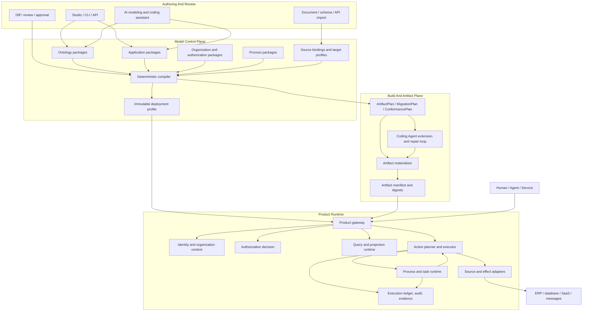

# Loushang Ontology-Driven Application Engineering Architecture

## Status

- Scope: cross-product target architecture
- Authority: normative target proposal
- Design status: proposed
- Implementation status: partial substrate only
- Review date: 2026-08-20

This document proposes a source-independent target architecture. It does not change the accepted
ownership or implementation status of Ontology, Harness, Coding, Method, HarnessWork, Work, Agent,
AI, Channel, HarnessTUI, or TUI. Accepted ARDs and each subsystem README remain authoritative for
Current behavior.

The product thesis that motivates this engineering architecture is described in
[Ontology-Native Intelligent Workplace Product Insight](ontology-native-intelligent-workplace-product-insight.md).

## 1. Strategy And Outcome

Loushang should support **Ontology-Driven Application Engineering (ODAE)**:

> Ontology is the semantic authority for business objects, properties, relations, Actions, and
> declared state ownership. Application models describe how humans and Agents observe and operate
> those semantics. A deterministic compiler produces verifiable deployment artifacts. Product
> runtime composes identity, organization, authorization, process, external effects, recovery, and
> audit. AI drafts models and implements bounded extensions but never becomes release, authorization,
> or fact authority.

The intended product is not another form builder, a renamed historical MDA metadata repository, an
academic knowledge graph, or a clone of an all-in-one data platform. Its intended differentiation is:

- existing enterprise systems may remain authoritative;
- applications and generated code can be held and deployed by the enterprise;
- semantic, application, process, policy, and physical concerns remain separately versioned;
- humans, services, and Agents use the same typed Query and Action contracts;
- model and artifact publication is deterministic, reviewable, testable, and reproducible.

## 2. Terminology

| Term | Meaning |
| --- | --- |
| Ontology Package | Versioned semantic definitions for objects, properties, relations, interfaces, Actions, constraints, and state authority. |
| Application Package | Versioned interaction definitions such as QueryView, Form, FieldBinding, ActionInteraction, and AgentToolBinding. |
| Organization Package | Reusable semantic definitions for principals, organization units, positions, structures, memberships, assignments, and delegations. |
| Authorization Package | Reusable definitions for grants, data scopes, property policies, duties, delegation requirements, and audit concepts. |
| Process Package | Versioned process, activity, transition, participant, and interaction definitions. It is not a running process instance. |
| Source Binding | A versioned mapping from an external source schema and record identity to stable Ontology semantic IDs. |
| Target Profile | A versioned selection of implementation targets, type mappings, generators, runtime providers, and deployment constraints. |
| Application Compiler | A pure deterministic compiler from locked semantic and interaction inputs to an ArtifactPlan and diagnostics. |
| ArtifactPlan | Canonical ordered descriptions of generated files, schemas, migrations, contracts, tests, and extension requirements. |
| Deployment Profile | An immutable, content-addressed selection of exact model, adapter, policy, process, target, and artifact inputs. |
| Product Runtime | The composition that owns authorization, credentials, external effects, process recovery, Action execution ledger, and user-facing behavior. |
| Coding Product | The coding-specific Product that uses Harness, Agent, and AI to modify and verify a workspace. It is not the Application Compiler. |

The historical terms PIM, AIM, and PSM remain useful as background, but the preferred operational
terms are Ontology Package, Application Package, and Source/Target Binding.

## 3. Core Invariants

1. Ontology defines business meaning but does not own Product credentials, vendor SDKs, UI widgets,
   workflow engine state, or deployment topology.
2. A stable business Property may be reused by many Application fields; an Application field never
   becomes the global semantic authority for that Property.
3. Drafts may be interpreted for preview. Releases use immutable model artifacts, compiler identity,
   dependency locks, and content digests.
4. The same locked compiler input produces the same ArtifactPlan and generated content digests.
5. Generated artifacts are disposable and reproducible. Human- or AI-authored extensions live only
   behind explicit contracts and in explicit extension locations.
6. Every business mutation enters through a typed Action. Generic CRUD cannot bypass authorization,
   state constraints, source authority, idempotency, or audit.
7. `ontology-owned`, `source-backed`, and `derived` state have different write contracts. Derived
   state is not directly writable.
8. Process coordinates work; domain Actions change business facts. Process state, task state, Action
   outcome, and domain state remain distinct.
9. Humans, service identities, and Agents are explicit Principals. Agent authority is bounded by an
   auditable delegation and never inferred from model capability.
10. AI output is always a draft, patch, extension, test, explanation, or recommendation. It cannot
    publish a model, grant authority, execute production DDL, or redefine fact authority by itself.
11. Product owns external effects, authorization, durable execution recovery, and acknowledgements.
    Ontology and the pure compiler do not execute vendor code.
12. Current subsystem facts and target proposals remain explicitly separated.

## 4. Logical System Context



This is a responsibility and information-flow view, not a process or Python import graph.

## 5. Model Stack

### 5.1 Ontology Model

Ontology answers what exists, how it is related, what can happen, and who owns state semantics:

```text
ObjectType / InterfaceType
PropertyDefinition
LinkType / Association definition
Constraint
ActionDefinition
StateAuthority
Event and Decision semantics, when accepted
```

Ontology identity must survive display-name and API-name changes. Source records, application fields,
process bindings, policies, APIs, and generated tools refer to stable semantic IDs rather than physical
table or widget names.

### 5.2 Application Model

Application answers how a human or Agent observes and operates Ontology semantics:

```text
QueryView
Form
FormFieldBinding
ActionInteraction
AgentToolBinding
Dashboard / ObjectView
Navigation and notification bindings
```

One Property can be required in a creation form, read-only in an approval form, filterable in a
QueryView, available to a report, and exposed as an Action parameter without being redefined.

Application policy is contextual. Visibility, editability, layout, prompt text, and device behavior do
not modify the underlying Ontology Property definition.

### 5.3 Organization And Authorization Models

The semantic package should be able to express:

```text
Principal = Person | Account | ServiceIdentity | AgentIdentity
OperationalThing = OrganizationUnit | Position | Person | Equipment | SoftwareAgent
Structure = tree | DAG | general graph
Membership / Assignment / Delegation
```

The Product authorization decision should eventually combine:

```text
Allow(subject, action, target, context) =
    FunctionalGrant
    AND DataScope
    AND PropertyPolicy
    AND StateConstraint
    AND PurposeConstraint
    AND SeparationOfDuty
    AND DelegationScope
```

This proposal does not place an authorization engine inside `loushang.ontology`. Product owns policy
resolution, subject context, credentials, decisions, enforcement, and audit.

### 5.4 Process Model

Process definitions and instances are separate:

```text
ProcessDefinition       ProcessInstance
ActivityDefinition      ActivityInstance
TransitionDefinition    TransitionOccurrence
ParticipantDefinition   WorkAssignment / Task
```

An activity may bind a versioned Application interaction and one or more semantic Action IDs. A
workflow provider may execute the process, but engine-specific node IDs, storage optimization, URLs,
and UI pages are Target Bindings rather than portable process meaning.

Enterprise process runtime remains distinct from Method, HarnessWork, and the compatibility `work`
namespace. Method describes reusable work guidance; HarnessWork owns durable accepted business
operation outcomes; neither silently becomes a generic BPM engine.

### 5.5 Source And Target Bindings

Source Binding maps existing authoritative systems into stable semantics:

```text
vendor application and schema version
source instance and record identity
table / column / JSON / message paths
object, property, and link semantic IDs
coverage, freshness, and authority declarations
```

Target Profile selects implementation output:

```text
database and migration dialect
backend and API stack
web or mobile renderer
MCP and SDK formats
workflow, identity, authorization, and notification providers
deployment constraints
```

Ontology does not import source or target implementations. Product and build compositions bind them
through public contracts.

## 6. Design, Release, And Runtime Separation

```text
Design
  mutable drafts + AI suggestions + preview + diagnostics

Review
  semantic diff + dependency impact + migration impact + policy impact

Release
  immutable package artifacts + exact dependency locks + compiler identity

Build
  ArtifactPlan + generated files + extension contracts + conformance evidence

Deploy
  DeploymentProfile + provider selections + secrets by reference + artifact manifest

Runtime
  schema-bound Query and Action execution + process state + audit and recovery
```

A running instance never follows a mutable draft. A process instance, application deployment, SDK, and
MCP surface must identify the model and artifact versions they consume.

## 7. Compiler And Artifact Boundary

The Application Compiler should be pure: it consumes immutable values and returns immutable plans and
diagnostics. It does not write files, run commands, call models, open network connections, or select
credentials.

```text
Ontology artifacts
  + Application artifacts
  + Process and policy artifacts
  + Source/Target locks
  + compiler version
  -> Canonical Application IR
  -> validation and impact analysis
  -> ArtifactPlan / MigrationPlan / ConformancePlan
```

Artifact materialization and verification are Product/build responsibilities. Workspace writes and
process execution should use shared Harness contracts rather than new compiler-owned filesystem or
subprocess implementations.

Generated output should use explicit ownership zones:

```text
generated/     disposable deterministic output; never edited
contracts/     generated stable extension interfaces
extensions/    human- or AI-authored implementations
adapters/      vendor and deployment integration
tests/         generated conformance plus authored domain cases
manifest/      input locks, compiler identity, output digests, evidence
```

The detailed proposed subsystem contract belongs in
[Application Model And Artifact Compiler](application-model-and-artifact-compiler.md).

## 8. Runtime Query Path

```text
Human / Agent intent
  -> typed QuerySpec
  -> authenticate Principal and deployment
  -> authorize query capability
  -> compile DataScope and property visibility
  -> execute against trusted Projection or Source Adapter
  -> deterministic filtering and masking
  -> response with schema and origin context
  -> audit
```

An LLM may translate intent into a typed QuerySpec. It does not authorize the query or generate and
execute unrestricted production SQL. Data-scope pushdown and trusted-boundary filtering must be
explicitly validated.

## 9. Runtime Action Path

```text
ActionRequest
  -> schema and argument validation
  -> resolve target and declared state authority
  -> read exact Projection and guard
  -> pure ActionPlan
  -> authorization and duty checks for the exact plan
  -> optional approval/process interaction
  -> execution-time reauthorization against latest state
  -> ontology-owned commit or source write-back
  -> acknowledgement and idempotency ledger
  -> projection refresh and event publication
  -> audit, evidence, recovery outcome
```

- Ontology-owned state uses an atomic guarded Fact commit.
- Source-backed state writes through the selected authoritative adapter before local success is
  reported; acknowledgement and projection update remain separate states.
- Derived state is recomputed, not edited.
- Cross-authority multi-effect Actions require an explicit later saga/compensation decision and are
  rejected until supported.

Workflow approval authorizes neither stale data nor unlimited future execution. The executor binds an
authorization decision to the exact plan and rechecks execution constraints immediately before the
effect.

## 10. AI Roles And Trust Boundary

### 10.1 Design Assistant

AI may derive model drafts, mappings, process candidates, policy candidates, tests, and explanations
from requirements, databases, APIs, spreadsheets, and existing code. The output is a reviewable draft
with provenance, not a published artifact.

### 10.2 Coding Assistant

AI may implement explicit extension contracts, adapters, special UI components, data transformations,
domain algorithms, compensation logic, tests, and documentation. The implementation must pass the
same compiler, policy, LSP, architecture, test, and review gates as human-authored code.

### 10.3 Runtime Agent

An Agent is an explicit Principal with owner, deployment, allowed Actions, DataScope, tools, budget,
validity, and delegation evidence. It calls the same Query and Action contracts as other clients and
cannot bypass Product authorization through internal tools or database access.

## 11. Current Subsystem Mapping

| Scope | Current reusable foundation | Target role or gap |
| --- | --- | --- |
| `ontology` | Versioned Schema, Fact/provenance, source mapping, projection, package/deployment locks, narrow Action planning | Remains semantic and authority substrate; no Product or generator ownership. |
| `harness` | Session/Host, tools, workspace, process execution, policy/approval, sandbox, resources, extensions, multi-agent substrate | Reused by build and AI execution; no domain compiler semantics. |
| `coding` | Coding Product composition, AI coding loop, LSP, architecture analysis, CLI/SDK/TUI | Hosts the first ODAE build capability; does not become compiler authority. |
| `agent` / `ai` | Agent loop and model/provider contracts | Consume typed Product tools; no authorization or fact authority. |
| `method` | Reusable method resources and compiled plans | Optional authoring/build guidance; not enterprise BPM. |
| `harnesswork` / `work` | Durable accepted operation lifecycle and compatibility namespace | May record build or Product work through adapters; not process definition ownership. |
| `application` | Not implemented as an accepted top-level scope | Proposed owner of Application Model and pure Artifact Compiler contracts. |
| Product organization/authorization/process | Not implemented as the proposed enterprise composition | Future Product-owned runtimes and Provider bindings. |

The current Ontology boundary remains defined by
[Ontology Architecture](../ontology/README.md). Coding remains defined by
[Coding Architecture](../coding/README.md). Work and Method remain defined by
[Work Architecture](../work/README.md) and [Method Architecture](../method/README.md).

## 12. Intended Dependencies

```text
application.model ---------> ontology public schema identities
application.compiler ------> application.model + ontology artifacts

product.build -------------> application.compiler + harness workspace contracts
coding Product ------------> product.build + harness/agent/ai public contracts

product runtime -----------> ontology public query/action contracts
product runtime -----------> Product-owned identity/authorization/process/adapters

ontology ----------------X-> application / product / coding / harness / vendor SDK
application.compiler -----X-> coding / Agent / AI / filesystem / network / credentials
harness ------------------X-> application or Ontology Product semantics
```

An early proof may mount an ODAE capability in Coding, but convenience does not reverse ownership.

## 13. Artifact Families

The target compiler may eventually produce these artifact families from one locked semantic graph:

| Family | Deterministic base output | Authored extension |
| --- | --- | --- |
| Database | Schema, constraints, indices, migration plan | Data transformation and backfill logic |
| API | Request/response schema, routes, errors, auth checkpoints, OpenAPI | Domain Action handlers and integrations |
| UI | Form/List/ObjectView schema, validation and bindings | Special components and interaction logic |
| MCP/SDK | Tool schema, typed client, policy requirement references | Product host and vendor connection code |
| Process | Portable definition and Action/Application bindings | Provider-specific worker or node adapters |
| Policy | Required decision inputs and enforcement points | Product policy rules and organization adapters |
| Tests | Schema, binding, compatibility, permission and regeneration tests | Domain examples and external integration cases |
| Documentation | Model and API reference, lineage and manifest | Product guidance and operational runbooks |

Generation support is a capability claim only after a Target Backend and its conformance tests exist.

## 14. First Vertical Slice

The recommended first slice is a purchase-request workflow because it requires relational data,
organization scope, authorization, process, generated application surfaces, and human/Agent
participation without requiring an entire industry model.

```text
Ontology
  Supplier, PurchaseRequest, PurchaseItem, Budget, ApprovalDecision

Actions
  CreateDraft, Submit, Approve, Reject, Cancel

Organization
  Company, Department, Position, Person, AgentIdentity

Authorization
  requester create; manager department scope; procurement assigned scope;
  finance property visibility; separation of requester and final approver;
  Agent pre-review delegation

Process
  submit -> manager approval -> amount branch -> procurement -> finance -> complete

Target
  one Python backend, one web renderer, one database dialect, one process provider,
  one identity provider, one MCP surface
```

Required evidence:

1. One Property drives database, API, form, query, MCP, and test contracts.
2. A manager sees only the authorized organization scope.
3. Property visibility differs by interaction without redefining the Property.
4. Human and Agent invoke the same Action contract; the Agent cannot widen delegation.
5. A process instance remains bound to its published version.
6. A breaking model change produces semantic, source, application, API, process, policy, and migration
   diagnostics.
7. Deleting generated output and rebuilding produces identical content digests.
8. AI-authored extension code cannot enter generated ownership zones and must pass conformance tests.

## 15. Evolution Order

1. Accept the ODAE vocabulary, ownership boundaries, and non-goals.
2. Define the minimal Application Model and pure compiler contracts.
3. Implement one target family end to end before creating a generic generator marketplace.
4. Mount the first build capability in Coding using shared Harness workspace and execution contracts.
5. Add minimal Product identity, organization, authorization, and process runtimes for the vertical
   slice; do not revive a monolithic BSP.
6. Prove Action authorization, source acknowledgement, idempotency, audit, and recovery.
7. Add Studio authoring and preview only after model contracts are stable enough to survive UI use.
8. Generalize Provider and package ecosystems from at least two real target or source implementations.

The initial physical deployment should prefer a modular monolith plus bounded asynchronous workers.
Microservice decomposition requires observed isolation, scaling, security, or ownership pressure.

## 16. Non-Goals

- Recreating the historical MDA metadata tables or JSP/Velocity generation stack.
- Making every database table an Ontology ObjectType or every column a global Property.
- Turning `loushang.ontology` into an application builder, workflow engine, policy engine, or service
  locator.
- Turning Coding sessions, model todo state, Method plans, or Work projections into Product fact
  authority.
- Supporting every language, frontend, database, workflow provider, and cloud in the first release.
- Building a complete data lake, BI suite, low-code suite, and AI platform before one vertical slice.
- Claiming distributed transactions across independent authorities without explicit protocol and
  failure semantics.

## 17. Open Decisions

1. Whether `application` becomes a top-level Architecture Scope or a Product-neutral package owned by
   a future Product scope.
2. The minimum canonical Application IR and whether Form, QueryView, and ObjectView share one binding
   base or remain independent types.
3. The Target Backend compatibility, capability, and version-selection protocol.
4. Whether ArtifactPlan contains canonical content or content-addressed generator instructions.
5. The ownership and persistence of build manifests, build evidence, and generated-artifact drift.
6. The exact Organization and Authorization package/runtime split.
7. The enterprise Process owner and its relationship to HarnessWork without collapsing either model.
8. The first supported source-backed Action acknowledgement and reconciliation contract.
9. The branch, proposal, registry, release, and environment-promotion model.
10. The Product name and whether ODAE is exposed as a public term or retained as an engineering name.

No open decision in this section authorizes implementation or changes an accepted subsystem boundary.
