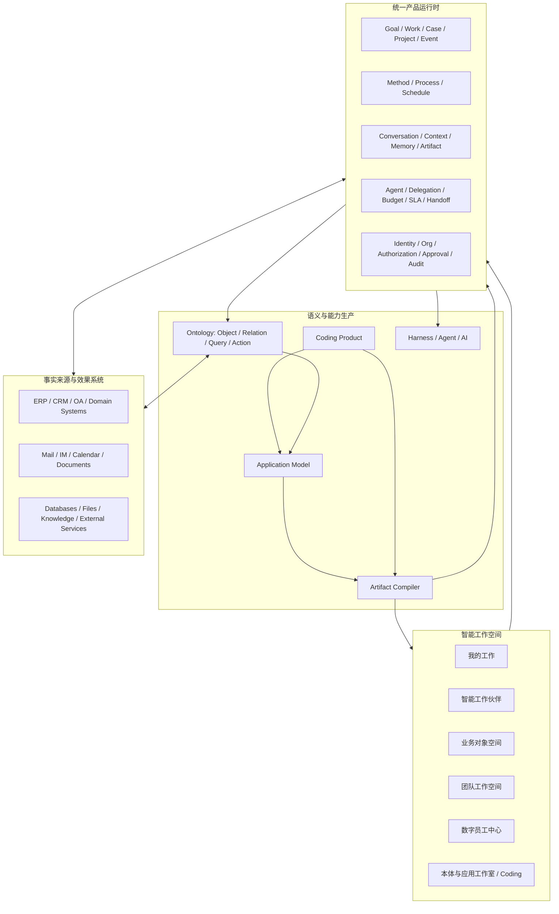

# 本体原生智能办公产品洞察

## 状态

- 范围：跨产品的产品命题与目标体验
- 权威性：非规范性架构洞察
- 设计状态：Draft
- 实现状态：仅有部分底层能力
- 复核日期：2026-08-20

本文综合 [腾讯 WorkBuddy 案例对 Loushang 的启示](workbuddy-lessons-for-loushang.md)中对一类智能工作
伙伴产品的观察、[本体驱动应用工程总体架构](ontology-driven-application-engineering.md)和
[Application Model 与 Artifact Compiler](application-model-and-artifact-compiler.md)，提出一个来源无关的
产品判断。本文不改变任何子系统当前边界；代码、测试、已接受 ARD 和 live architecture note 仍是
Current 行为的权威来源。

本文所称“智能工作伙伴”是一个通用产品角色，不指代腾讯 WorkBuddy，也不建议将 WorkBuddy 用作
Loushang 的产品名或公共架构术语。腾讯 WorkBuddy 仅是理解这一类产品形态的参考案例之一。

## 1. 核心洞察

下一代办公产品的中心不应继续是邮件、聊天、文档、表格和相互隔离的应用，而应是：

> 人与数字员工在同一套企业语义、工作事实和治理规则之上，围绕目标、业务对象、动作、决策、
> 承诺和异常共同运行组织。

邮件、聊天、文档、表格不会消失，但会从“工作本身”和“事实中心”逐渐降级为：

- 外部交换渠道；
- 人际协商和叙事界面；
- 临时分析工具；
- 法律或审计证据；
- 对业务事实的按需投影和冻结快照。

这不是给传统办公套件增加一个聊天框，也不是把低代码、Coding Agent 和流程引擎简单拼接。
目标产品是一套**本体原生智能工作操作系统**：智能工作伙伴是统一协作入口，Ontology 是共同语义，
Work/Method/Process 是工作运行机制，Coding 和 Compiler 是能力生产机制，数字员工是受治理的执行主体。

## 2. 为什么智能工作伙伴单独不能打通企业办公

智能工作伙伴类产品可以很好地包装个人任务、文件、工具、技能、连接器和 Agent 执行，但企业办公的
“打通”并不等于能打开更多软件或调用更多 API。它至少还需要回答：

- 当前谈论的是哪个客户、合同、订单、项目或风险？
- 这些对象之间是什么关系，哪个系统拥有哪项事实？
- 当前状态为什么形成，阻塞条件和责任人是谁？
- 当前用户或数字员工为什么有权读取或执行？
- 一个动作会改变哪些事实、触发哪些流程和外部效果？
- 失败、重试、补偿、审批和人工接管如何处理？
- 结果如何进入持续可查询、可回放、可审计的工作记录？

缺少这些能力时，智能工作伙伴仍然主要是“操作电脑和工具的助手”。接入本体、工作运行时和企业治理后，
它才能成为“理解并运行企业工作的入口”。

同样，其他单项能力也不构成完整产品：

| 单项能力 | 独立价值 | 单独存在时的缺口 |
| --- | --- | --- |
| 智能工作伙伴 | 自然交互、任务包装、上下文组织 | 缺少稳定业务语义、企业事实和治理闭环 |
| Ontology | 对象、关系、Action 和来源语义 | 缺少完整用户体验、工作编排和产品执行责任 |
| Coding | 构建长尾能力和系统集成 | 不能成为业务事实、发布或授权权威 |
| Workflow | 固定流程自动化 | 难以表达开放目标、复杂关系和动态能力缺口 |
| Digital Employee | 持续执行和规模化数字劳动力 | 没有语义、权限和证据时不可控也不可审计 |

## 3. 三合一产品，而不是三个产品

Coding、智能工作伙伴和本体驱动数字员工应当是同一个产品的三种工作模式：

| 模式 | 用户意图 | 人的控制程度 | 产品责任 |
| --- | --- | --- | --- |
| 协作：智能工作伙伴 | 理解、分析、规划、沟通、完成一次工作 | 人机协作 | 组织上下文，解释状态，提出并执行受权动作 |
| 构建：Coding | 补齐工具、应用、模型和集成 | 人主导 | 产生可审阅、可测试、可发布的能力变更 |
| 运营：Digital Employee | 按职责持续经营某类工作 | 人委托 | 在预算、权限、流程和 SLA 内运行并汇报异常 |

三种模式必须共享：

- 同一业务本体和 Query/Action 合同；
- 同一身份、组织、权限和策略决策；
- 同一 Work、Method、Process 和事件事实；
- 同一业务数据、文档证据和来源映射；
- 同一审批、审计、失败和人工接管机制；
- 同一套由 Application Model 与 Compiler 生产的应用能力。

如果三种模式各自拥有任务、记忆、权限、工具和运行记录，它们只是三个被放在同一界面里的产品，
不会形成新办公范式。

## 4. 目标产品架构



这张图表达的是产品责任关系，而不是建议把所有能力放入一个包：

- Ontology 保持语义和来源中立，不拥有产品凭据、组织策略和外部副作用；
- Product Runtime 拥有身份、授权、凭据、外部效果、持久恢复和用户可见行为；
- Work 记录发生了什么，Method/Process 描述应该怎样工作；
- Harness/Agent/AI 提供中立执行机制，不成为业务事实或授权权威；
- Compiler 生成确定性 ArtifactPlan，不直接发布或修改生产环境；
- Coding 实现长尾扩展，但必须经过模型、测试、评审和发布链路。

## 5. 新办公的一等工作原语

传统办公把消息和文件作为主要容器。本体原生办公应优先呈现以下概念：

| 原语 | 含义 | 主要责任层 |
| --- | --- | --- |
| Object | 客户、合同、订单、项目、资产、风险等业务对象 | Ontology + authoritative source |
| Goal | 希望达到的业务结果 | Product / Work Runtime |
| Work / Case | 有责任人、状态、期限和结果的工作事项 | Work Runtime |
| Event | 已发生且可追溯的业务或运行事实 | Work / Product ledger |
| Query | 对业务语义的只读观察合同 | Ontology + Product authorization |
| Action | 可校验、可授权、可执行的业务动作合同 | Ontology plan + Product execution |
| Decision | 人或被授权主体作出的选择及依据 | Product / Work Runtime |
| Commitment | 主体对结果、期限或条件承担的责任 | Product / Work Runtime |
| Method / Process | 可复用工作方法和受控流程 | Method / Product process runtime |
| Evidence / Artifact | 支撑事实、决策和交付的材料 | Work refs + Product storage |
| Agent / Digital Employee | 具有身份、职责、权限、预算和监督关系的执行主体 | Product Agent Runtime |
| Policy / Approval | 对访问、动作和风险的治理要求 | Product governance |

“一等原语”不意味着全部归 Ontology 所有。必须继续区分语义定义、权威事实、运行记录、产品策略和
外部执行责任。

## 6. 邮件、聊天、文档和表格的新位置

### 6.1 邮件

邮件从内部流程和任务数据库降级为外部异步交换、正式通知和证据渠道。审批、状态变化和责任分配应
发生在正式 Action 与 Work 记录中，邮件只承载通知或外部回执。

### 6.2 聊天

聊天继续承载协商、模糊表达、关系沟通和自然语言交互，但不能成为唯一事实来源。系统应能在授权和
确认后，把“下周交付”“同意变更”“请某人负责”等表达投影为 Commitment、Decision 或 Work。

聊天框也不应成为唯一未来 UI。用户需要比较、决策、审批、分析关系或处理异常时，产品应生成更合适的
表格、对象页、关系图、决策面板或异常工作台。

### 6.3 文档

文档保留叙事、论证、设计、法律文本和对外交换价值，但不应独占结构化业务事实。例如合同应首先是
包含参与方、条款、义务、付款计划、风险和状态的业务对象；签署 PDF 是该对象的法律快照和证据。

### 6.4 表格

表格保留临时探索、试算、假设分析和便携交换价值，但不应长期充当影子数据库。稳定表格应逐步被识别为
Object 集合、QueryView、规则、应用模型或业务指标；需要时再投影成表格。

### 6.5 表单、会议和报告

- 表单成为创建或变更 Object/Action 的一种生成式交互，而不是孤立应用的中心；
- 会议成为产生 Event、Decision、Commitment 和 Work 的同步协作场景；
- 周报、经营报告和项目状态成为从受权事实中按需生成的视图，而不是人工复制数据形成的新事实源。

因此，媒介没有消失，其职责从“保存和组织企业真相”收缩为“表达、交换、探索和证明企业真相”。

## 7. 六个一致的产品界面

目标产品可以呈现六个界面，但它们必须是同一 Product Runtime 和 Ontology 的投影：

1. **我的工作**：统一目标、待办、事项、异常、审批、通知和数字员工汇报。
2. **智能工作伙伴**：查询、解释、规划、创建、协调和执行企业工作。
3. **业务对象空间**：呈现客户、合同、项目、订单等对象的状态、关系、历史和可用 Action。
4. **团队工作空间**：让人与数字员工围绕 Case、Project、Method 和 Process 共同工作。
5. **数字员工中心**：配置身份、职责、授权、预算、排班、SLA、监督、考核、暂停和人工接管。
6. **本体与应用工作室**：用建模、自然语言和 Coding 演化 Ontology、Application Model、工具和集成。

用户看到哪种界面取决于当前工作意图，而不是由数据被存在哪个应用决定。

## 8. 从一次协作到持续数字劳动

产品最关键的复利闭环不是完成一次 Agent 调用，而是把成功工作逐步转化为组织能力：

```text
人与智能工作伙伴完成一次工作
  -> Product 记录 WorkEvent、输入、决策、动作和产物
  -> 识别稳定步骤、约束、验收条件和异常路径
  -> 沉淀为 Method 或受控 Process
  -> 发现缺失的 Object、Query、Action、UI 或系统集成
  -> Coding 提出并实现模型与长尾扩展
  -> Compiler 生成数据库/API/UI/MCP/测试等 ArtifactPlan
  -> Product 完成评审、迁移、发布和授权
  -> 数字员工在职责、预算和 SLA 内持续运行
  -> 运行证据继续改进本体、方法、应用和治理规则
```

一句产品化表达是：

> 智能工作伙伴帮人把事情做成一次，Method 把做法沉淀下来，Coding 把能力工程化，Ontology 让能力进入
> 企业共同语义，数字员工把它持续运行起来。

AI 可以解释、起草、建议和实现候选变更，但不能成为事实、授权、发布或验收权威。

## 9. 一套内核，三种治理档位

个人、个人公司和企业员工不应对应三套平台，而应是同一内核的渐进治理配置。

### 9.1 个人效率

- 单用户或私人工作空间；
- 本体尽量从文件、任务和行为中隐式形成，不要求用户先建模；
- 智能工作伙伴是主要入口，Coding 用于个人工具，数字员工以监听、定时和代办为主；
- 私人记忆、数据和凭据默认隔离，强调可携带和可退出。

### 9.2 个人公司与小团队

- 一个人可以承担经营者、销售、产品、交付和客服等多个角色；
- 数字员工成为虚拟岗位，围绕客户、产品、合同、订单、内容和现金流工作；
- Method 固化经营方法，Coding 快速产生差异化微型应用；
- 开始启用团队授权、审批、预算和经营结果核算，但保持低配置成本。

### 9.3 企业商业办公

- 启用租户、组织、岗位、角色、代理关系和职责分离；
- 支持对象级、属性级、关系级和 Action 级策略决策；
- 支持流程、审批、审计、凭据隔离、运行恢复、合规和人工接管；
- 数字员工拥有正式机器身份、授权期限、预算、SLA 和绩效证据；
- 现有企业系统可以继续拥有权威数据，Ontology 通过来源映射统一语义。

个人用户看到的是智能工作伙伴，而不是本体平台；企业用户得到的是可治理的工作系统，而不是更大的聊天框。

## 10. 进入企业的演进路径

产品不应在第一阶段要求替换现有办公、ERP、CRM 和行业系统。更可行的路径是：

1. **语义覆盖层**：读取现有邮件、聊天、文档、表格和业务系统，建立对象、关系、来源和统一查询。
2. **受控动作层**：增加跨系统 Action、授权、审批、执行账本、失败恢复和人工接管。
3. **能力生产层**：用 Application Model、Compiler 和 Coding 生成缺失应用、工具、测试和集成。
4. **数字劳动层**：将稳定 Method/Process 委托给数字员工持续运行，以业务结果和异常为主要交互。
5. **新事实中心**：在证据充分且治理成熟的领域，逐步让 Ontology/Product Runtime 承担新的工作事实权威。

迁移期间必须允许旧系统和新产品并存，显式声明每项事实、状态和外部效果的权威所有者，避免“双写即真相”。

## 11. 市场命题与产品切口

这是一个可能横跨个人效率、办公协作、低代码、企业工作流、Agent 平台和数字劳动力的平台级机会，但
平台市场不等于可以用平台方式起步。

三个用户层的商业特征不同：

| 用户层 | 优势 | 主要难点 | 更适合的作用 |
| --- | --- | --- | --- |
| 个人效率 | 用户规模大、反馈快 | 付费低、通用助手竞争强 | 获客、体验验证和生态入口 |
| 个人公司/小团队 | 购买者即使用者、ROI 清晰、系统包袱较轻 | 场景碎片化、可靠性要求高 | 最适合验证经营闭环的早期切口 |
| 中大型企业 | 客单价和长期壁垒高 | 销售、集成、治理和交付周期长 | 平台成熟后的主要价值市场 |

早期不应销售“本体平台”，而应销售可度量的工作结果，例如更快完成销售跟进、项目交付、客户服务或
经营分析。较好的验证单元不是“支持所有办公”，而是：

> 一个真人能否带领一组数字员工，在一个明确行业或经营场景中完成从获客、履约到复盘的可审计闭环。

## 12. 差异化和复利壁垒

简单组合聊天、Coding、工作流和多个 Agent 很容易同质化。可持续差异来自长期保持以下连续性：

- **语义连续性**：一次对话、一个应用、一个流程和一个 Agent 操作同一业务对象与 Action；
- **工作连续性**：Goal、Work、Decision、Commitment、Event 和 Artifact 可以跨界面持续演化；
- **方法连续性**：成功经验从临时提示逐步成为有版本、有验收和异常路径的 Method；
- **治理连续性**：人、服务和数字员工通过同一身份、授权、审批和审计边界行动；
- **工程连续性**：模型、代码、迁移、测试和发布可以相互追踪并确定性复现；
- **证据连续性**：每项关键判断和外部效果都有来源、执行记录、结果和责任主体；
- **资产连续性**：客户可持有模型、生成 Artifact 和业务数据，而不是被锁在不可解释的 Agent 会话中。

随着使用增加，客户积累的不只是聊天历史，而是业务本体、企业记忆、方法、应用、运行证据和数字员工
能力。这些资产共同形成产品复利。

## 13. 对当前 Loushang 架构的含义

现有 ODAE 与 Artifact Compiler 主要覆盖“语义建模和能力生产”，要支撑完整产品，还需要位于其上方的
智能工作产品架构。至少需要逐步明确：

1. 统一 Work Runtime 中 Goal、Case、Project、Decision、Commitment 和 Event 的最小公共合同；
2. Conversation、Context、Memory、Artifact 与业务对象的引用和隔离规则；
3. 数字员工的身份、职责、授权、委托、预算、SLA、绩效、暂停和接管生命周期；
4. 个人、团队和企业空间的租户边界、数据主权和渐进式治理；
5. 连接器凭据、外部效果、幂等、重试、补偿和审计的 Product-owned 运行时；
6. 智能工作伙伴、对象页、团队空间和数字员工中心使用同一 Query/Action/Work 合同的方式；
7. 从非结构化媒介提取候选语义时的证据、置信度、确认和回滚机制；
8. 从一次工作到 Method、Application Model、Compiler 和发布链路的受控提升过程；
9. 以业务结果、成本、风险和人工接管率衡量数字员工，而不是只统计对话或 token；
10. Product 的正式名称，以及 ODAE 是内部工程术语还是对外能力名称。

这不要求把所有概念立即提升为新顶层包。应先通过产品垂直切片验证合同和所有权，再决定公共边界。

## 14. 产品与架构不变量

1. 邮件、聊天、文档和表格默认不是新的业务事实权威。
2. 人、服务和数字员工使用同一受类型约束的 Query/Action 合同。
3. 隐藏按钮、提示词约束或 Agent 自我声明都不构成授权。
4. Ontology 定义语义和来源映射，但不拥有产品凭据、组织策略或外部副作用。
5. Work 记录实际发生的运行事实，Method/Process 不伪造实际完成状态。
6. Chat 是重要交互，但不能成为唯一 UI、唯一上下文或唯一运行记录。
7. Coding 和 AI 不能直接绕过模型锁、测试、评审、迁移、发布和生产授权。
8. 数字员工必须具有可撤销身份、有限授权、预算边界、运行证据和人工接管路径。
9. 每项事实和效果必须有明确权威所有者；跨系统集成不能通过无界双写制造多份真相。
10. 个人体验可以隐藏本体复杂度，但不能牺牲数据隔离、可解释性和可退出性。

## 15. 非目标

- 第一阶段直接替换所有邮件、IM、文档、表格、OA、ERP 和 CRM；
- 把所有自然语言都自动转换为正式业务事实而无需确认；
- 认为所有工作都适合自动化，或追求无人承担责任的“全自动公司”；
- 要求个人和小团队在获得价值之前完成重型本体建模；
- 用一个巨型聊天会话代替对象视图、决策界面、异常工作台和运行账本；
- 让 Ontology、Harness、Agent、Coding 或 Compiler 吞并 Product 应承担的授权和外部执行责任；
- 以“使用了 Agent”代替业务结果、可靠性、安全性和经济性验收。

## 16. 需要通过产品验证回答的问题

1. 首个行业和经营闭环是什么，哪一项结果足以让客户持续付费？
2. 个人空间向团队或企业空间升级时，身份、数据、方法和数字员工如何迁移？
3. 哪些媒介内容可以自动成为候选 Object/Event，哪些必须保留为不可推断的 Evidence？
4. Work、Case、Project、Process Instance 和 Agent Run 的用户心智边界是什么？
5. 数字员工的“岗位”应由 Role、Method、Policy、Tool 和 SLA 如何组合？
6. 何时由现有系统继续拥有事实，何时允许新 Product Runtime 成为权威？
7. 如何度量从一次协作提升为稳定 Method 和数字员工的成功率与经济收益？
8. 哪些能力应该确定性编译，哪些保留为运行时解释，哪些允许 Coding 扩展？
9. 发生错误时，产品如何解释原因、展示影响、恢复状态并界定责任？
10. 用户最终购买的是智能伙伴、数字员工、经营结果，还是智能工作操作系统？不同阶段如何表达？

## 17. 最终产品定义

可以用一句话定义目标产品：

> Loushang 是以工作空间为入口、以本体为共同语义、以 Work/Method 为运行事实和方法、以 Coding 为
> 能力扩展、以数字员工为执行主体、以组织权限流程为治理底座的人机协同智能工作操作系统。

它改变的不是某一个办公工具，而是工作的基本组织方式：

> 今天，人围绕消息、文件和应用工作；未来，人和数字员工围绕业务对象、目标、决策、承诺和异常工作，
> 消息、文档、表格和应用只是系统在需要时生成的交互与交付形式。
