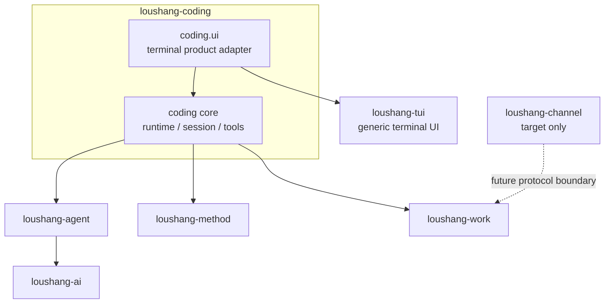

# Loushang Subsystem Diagram

## Scope

本文档给出 `loushang` 当前包级子系统关系图。
箭头表示依赖方向：`A --> B` 表示 `A` 依赖 `B`。

`loushang-tui` is a generic terminal UI subsystem. Coding-specific terminal behavior lives in
`loushang.coding.ui`, which depends on both `loushang-tui` and the headless
`loushang-coding` core.

`loushang-channel` is target architecture only. The current RPC implementation is the
`loushang.coding.mode.RpcMode` surface, not a package-level `src/loushang/channel/`
implementation.
